# Enterprise Identity and Access Behavior Examples

## 1. Workforce SSO login
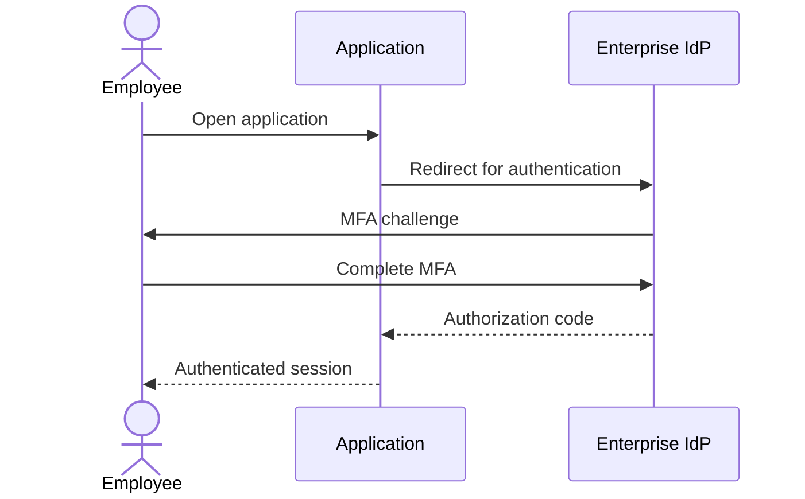

## 2. OIDC token refresh
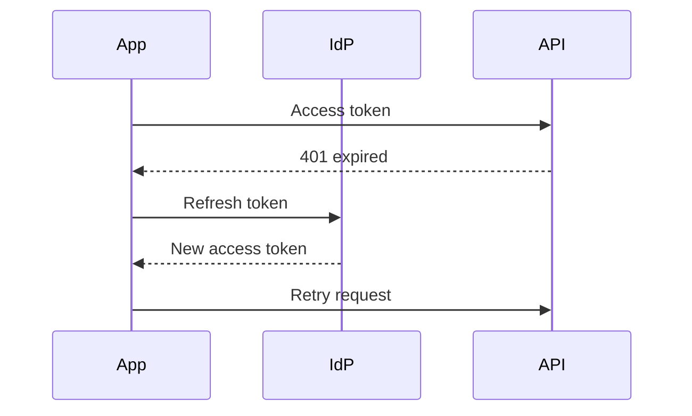

## 3. SCIM joiner provisioning
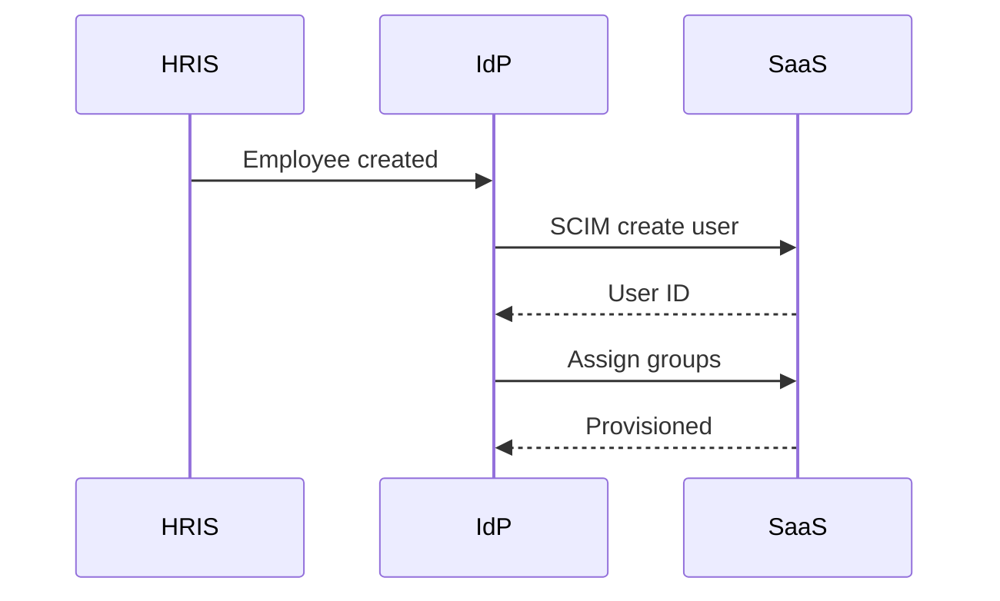

## 4. Leaver deprovisioning
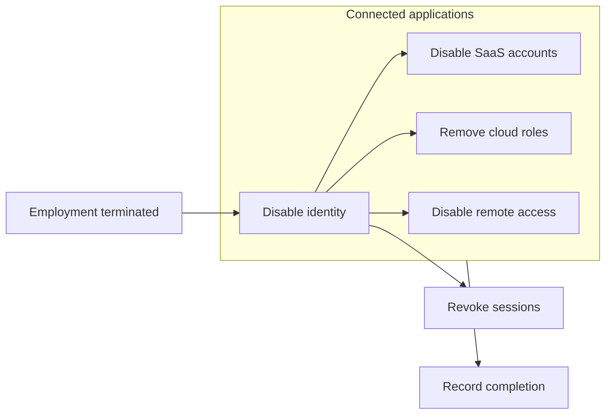

## 5. Step-up authentication
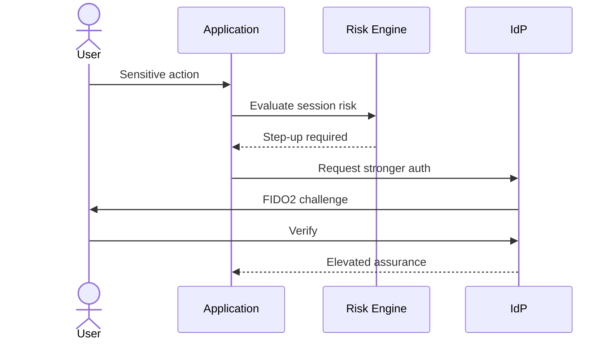

## 6. Privileged access request
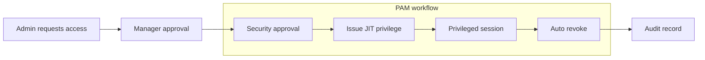

## 7. Break-glass access
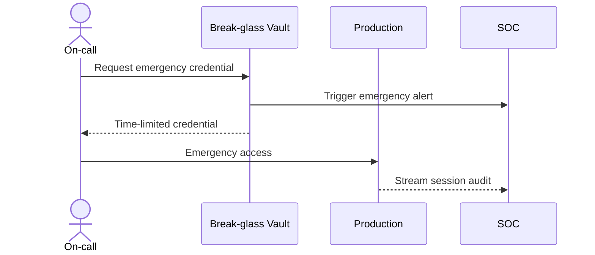

## 8. Workload identity token exchange
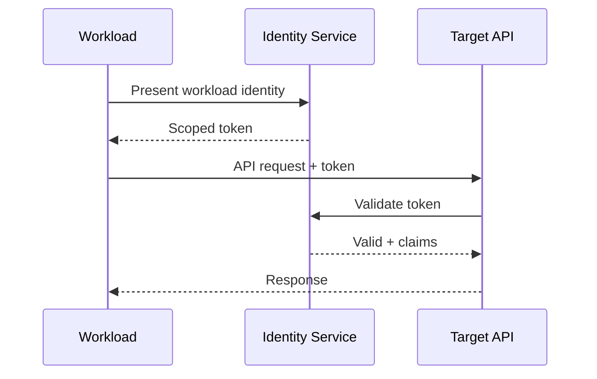

## 9. OAuth delegated tool access
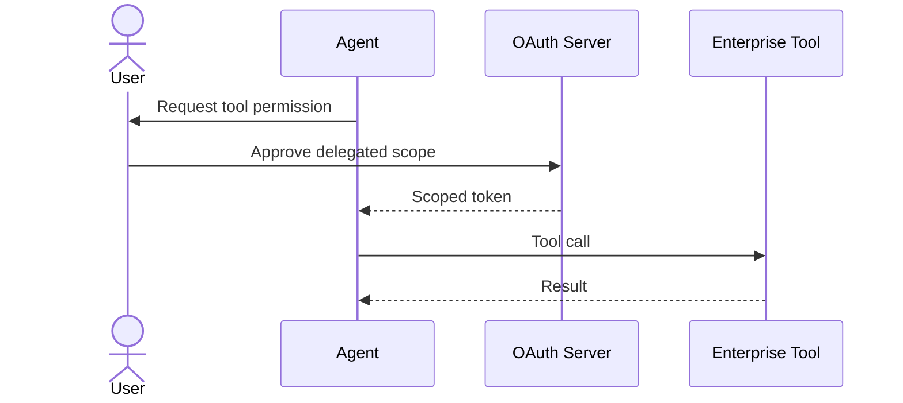

## 10. Access recertification
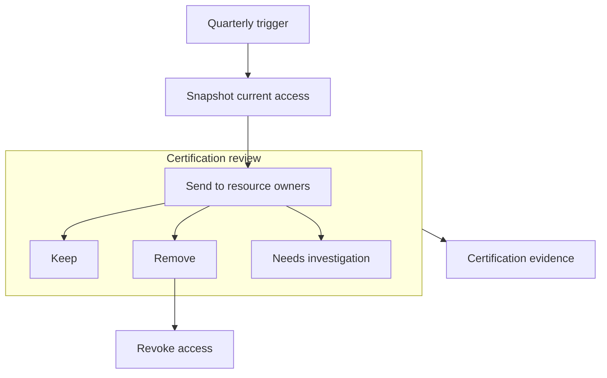

## 11. Password reset with identity proofing
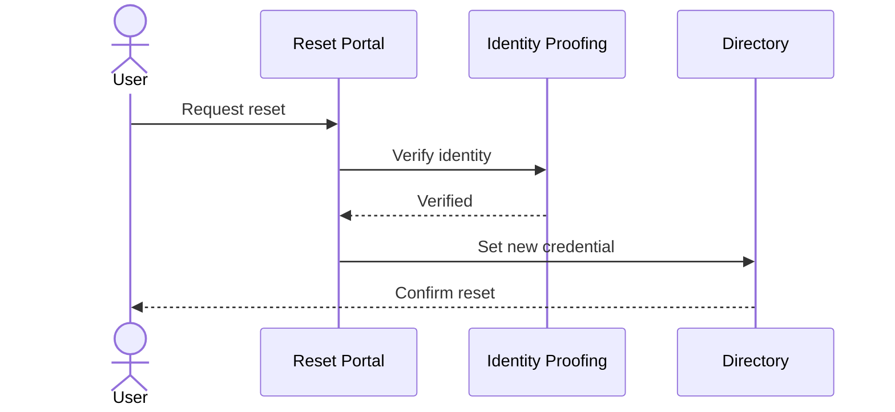

## 12. Device enrollment
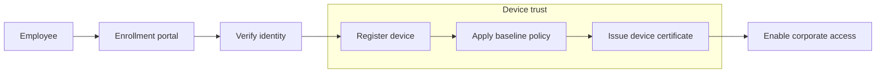

## 13. Risk-based access denial
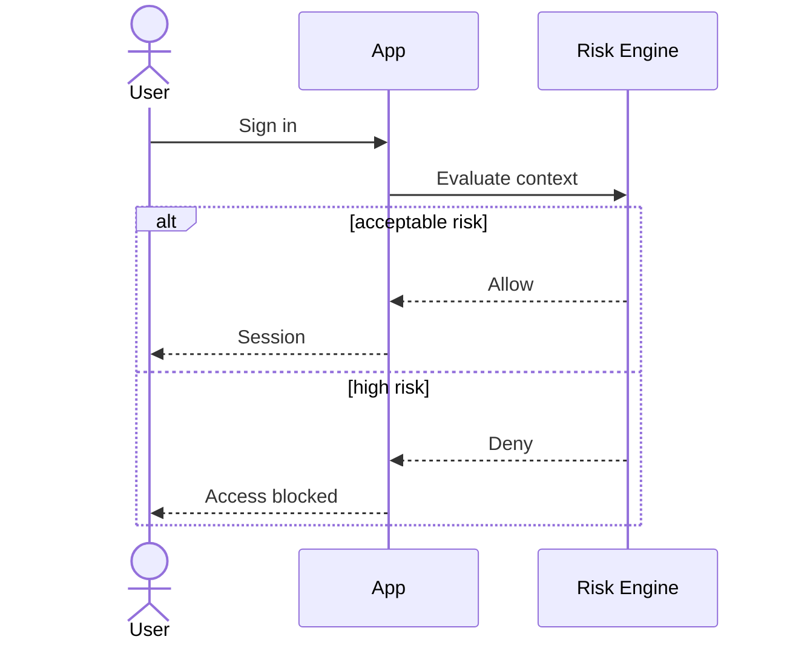

## 14. Role request workflow
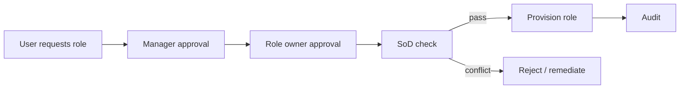

## 15. Service account creation
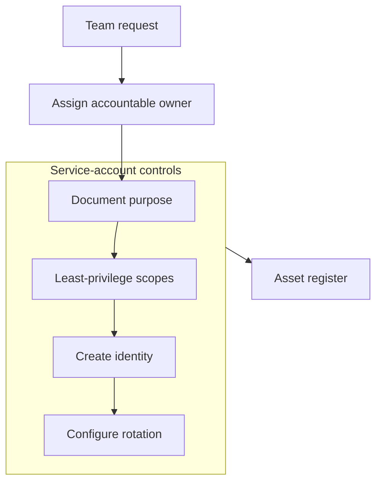

## 16. Certificate renewal
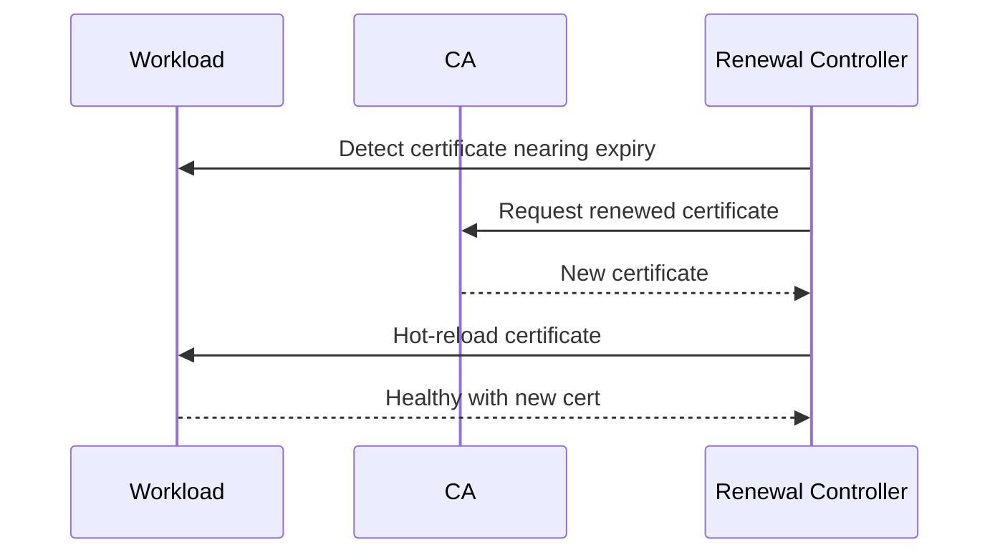

## 17. Session revocation after compromise
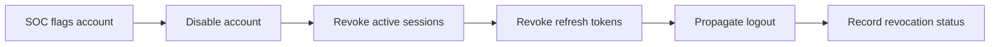

## 18. Temporary contractor access
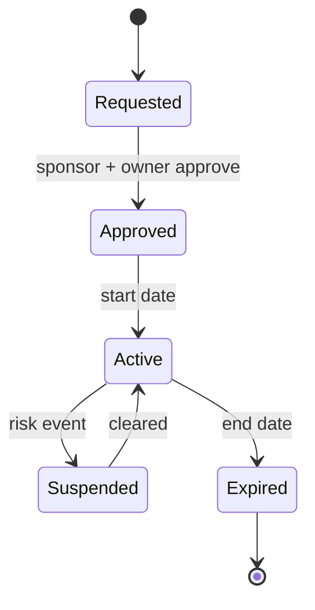

## 19. API key rotation
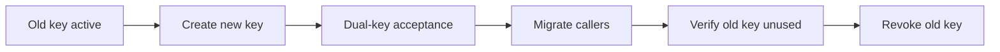

## 20. Privileged session lifecycle
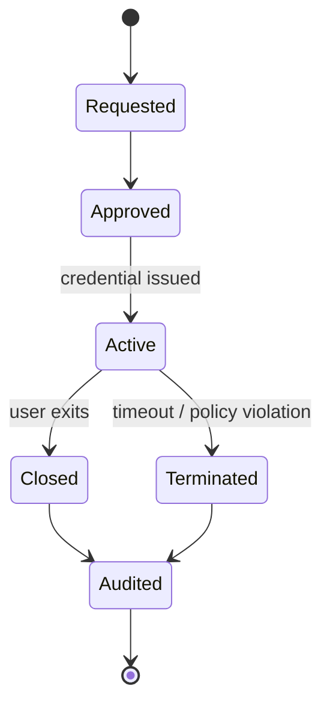