# Enterprise Incident and Operations Behavior Examples

## 1. Alert to incident
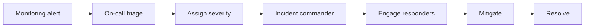

## 2. Major incident command
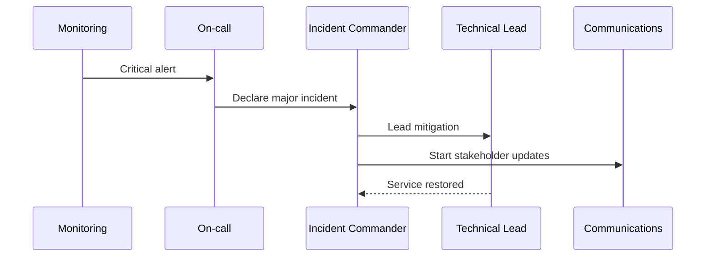

## 3. Escalation after no acknowledgement
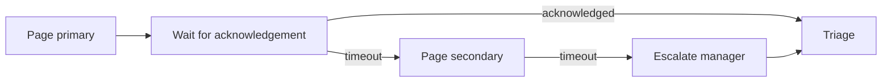

## 4. Incident lifecycle
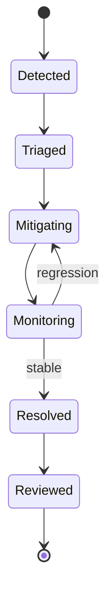

## 5. Customer communication cadence
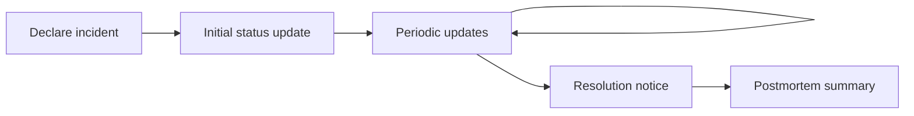

## 6. Runbook execution
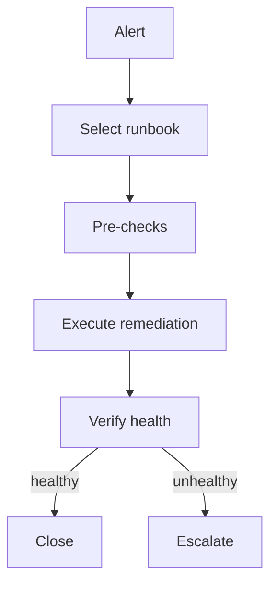

## 7. Automated remediation with human fallback
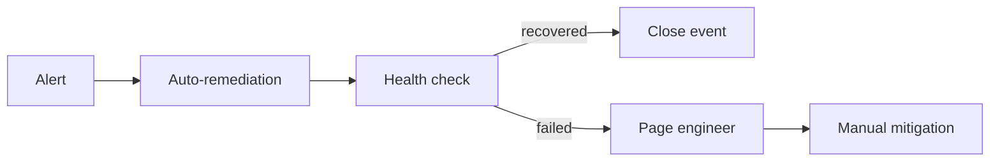

## 8. Security incident handoff
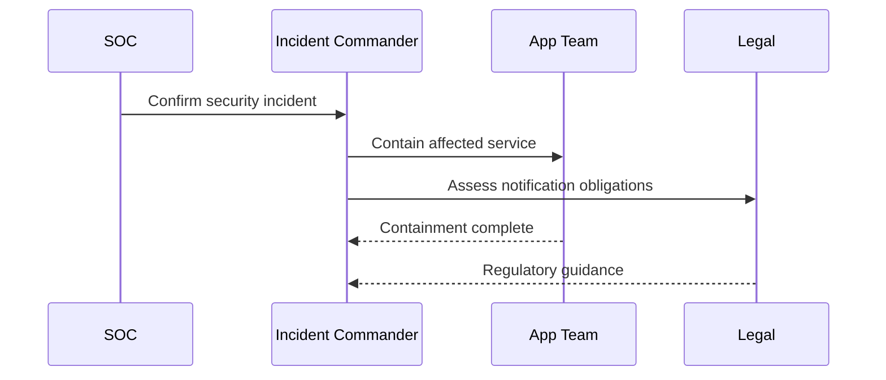

## 9. Production access during incident
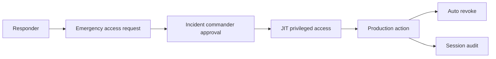

## 10. Postmortem workflow
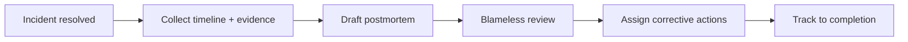

## 11. Error-budget escalation
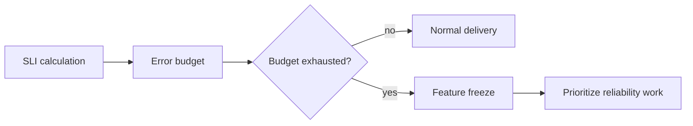

## 12. Capacity incident
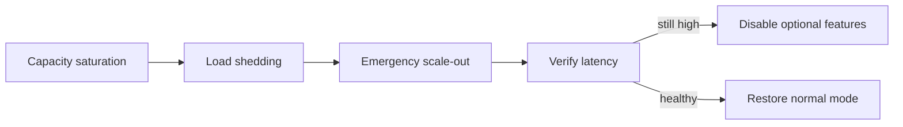

## 13. Database failover incident
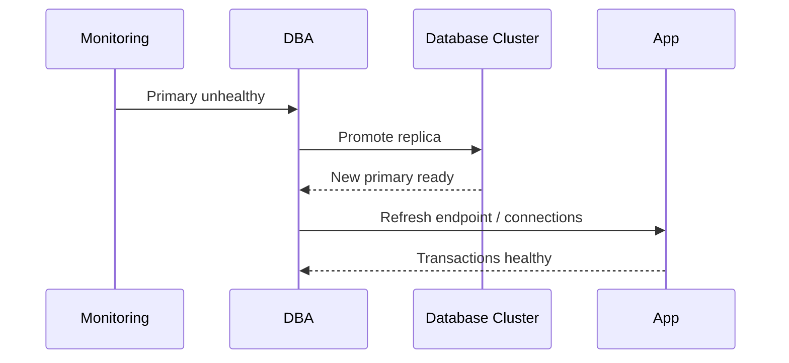

## 14. Third-party outage response
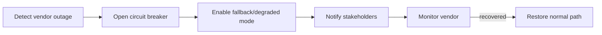

## 15. Queue backlog incident
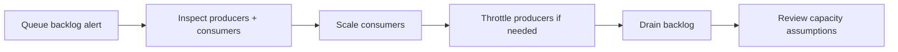

## 16. Certificate expiry incident
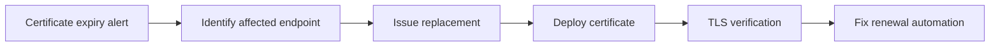

## 17. Data quality incident
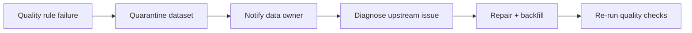

## 18. Incident severity reassessment
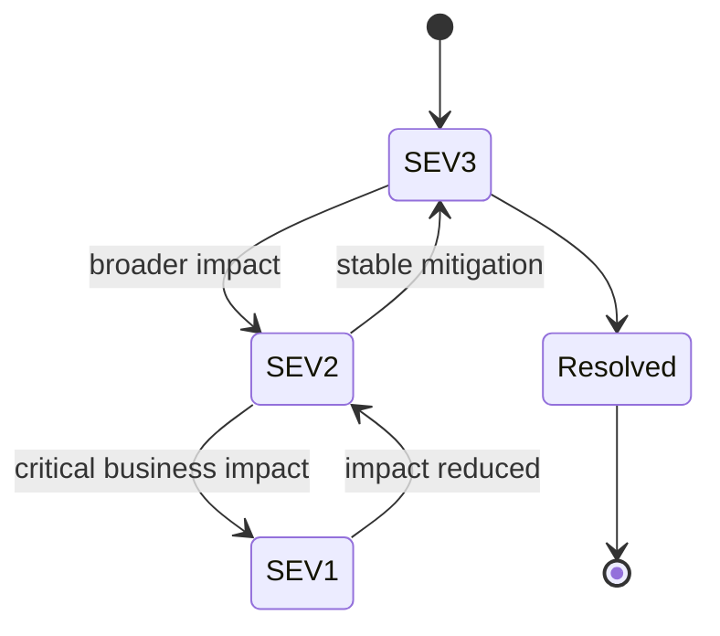

## 19. Follow-the-sun handoff
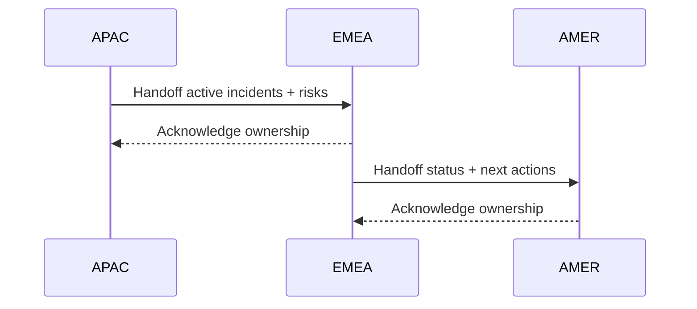

## 20. Operational problem management
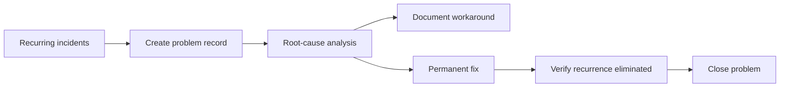