# Enterprise Resilience and Recovery Behavior Examples

## 1. Regional failover
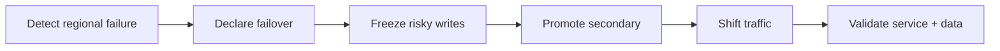

## 2. Database restore
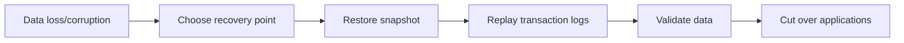

## 3. Backup restore test
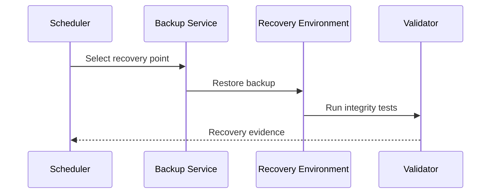

## 4. Service degradation
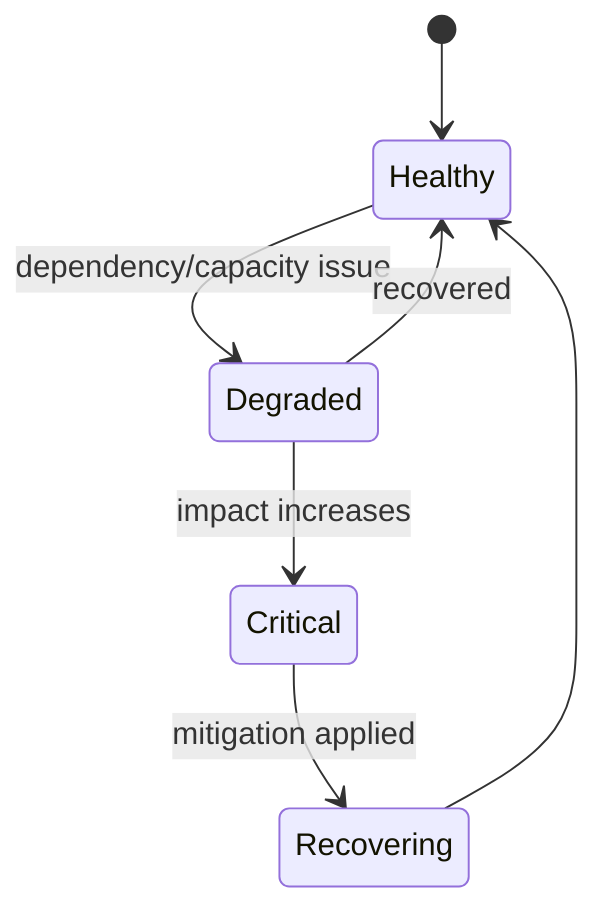

## 5. Circuit-breaker recovery
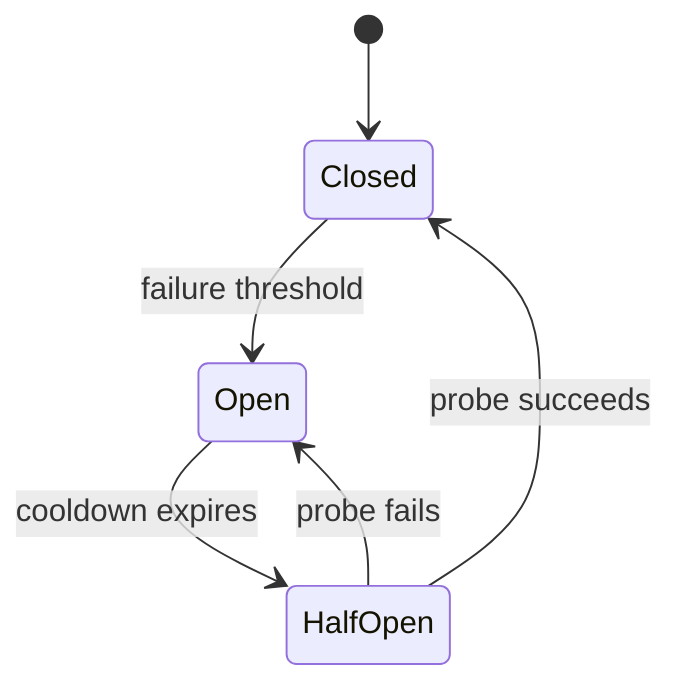

## 6. Disaster declaration
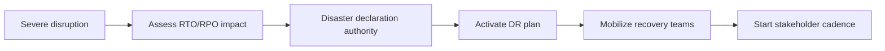

## 7. Controlled failback
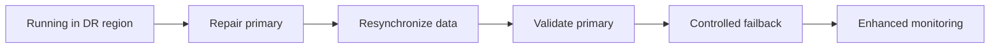

## 8. Dependency fallback
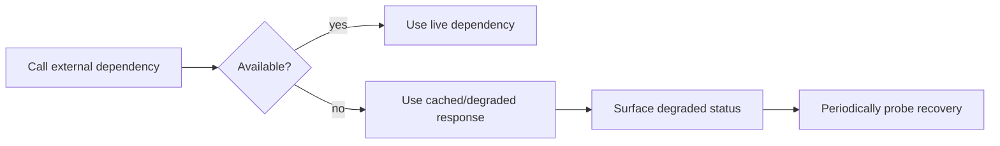

## 9. Queue disaster recovery
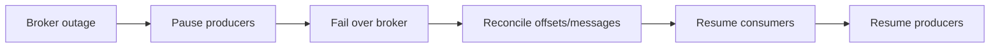

## 10. Ransomware recovery
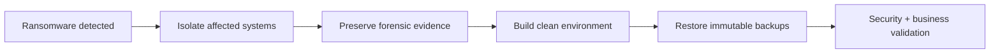

## 11. Lost-region communications
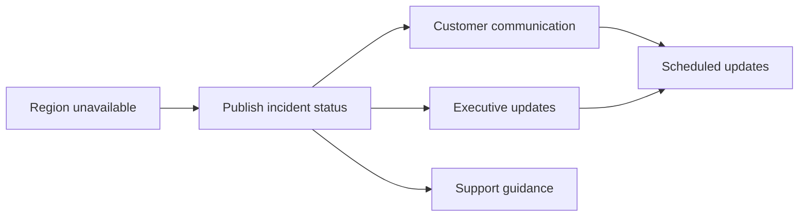

## 12. DNS failover
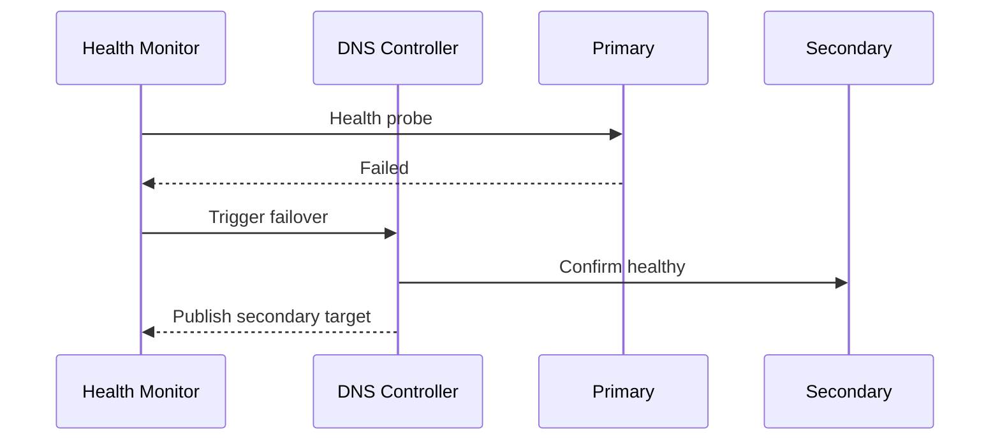

## 13. Data replication lag response

## 14. Corrupt release recovery
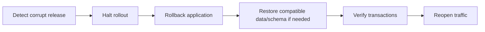

## 15. Capacity emergency
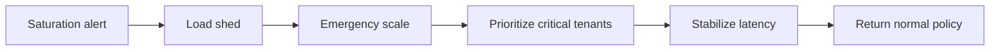

## 16. DR exercise
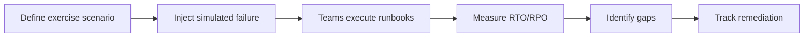

## 17. Restore approval gate

## 18. Multi-service recovery order
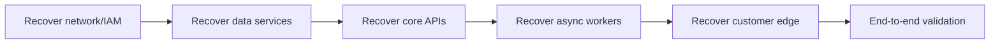

## 19. Degraded-mode exit
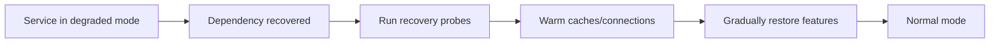

## 20. Recovery state machine
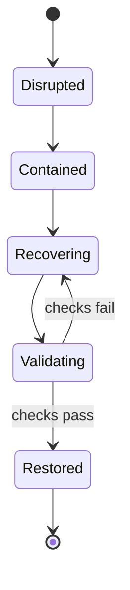