# Enterprise AI and Agent Platform Architecture Examples

## 1. Enterprise LLM gateway
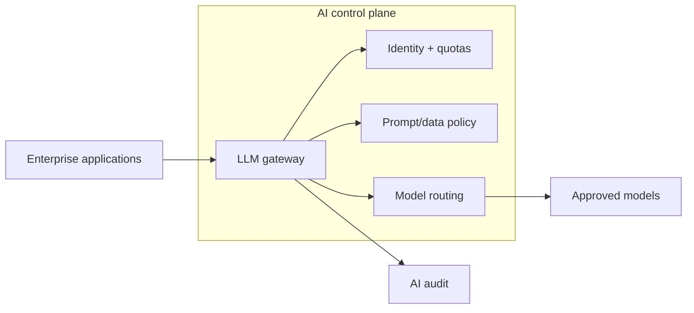

## 2. Governed RAG platform
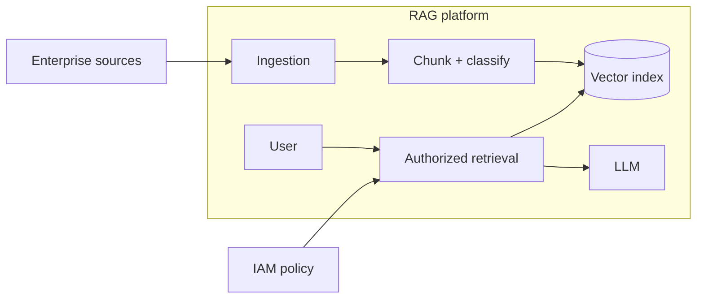

## 3. Agent tool boundary
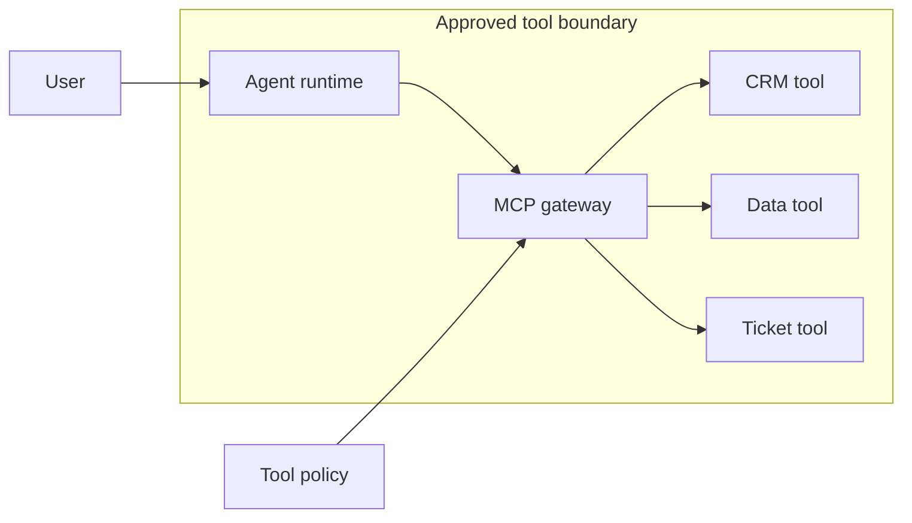

## 4. Human approval for side effects
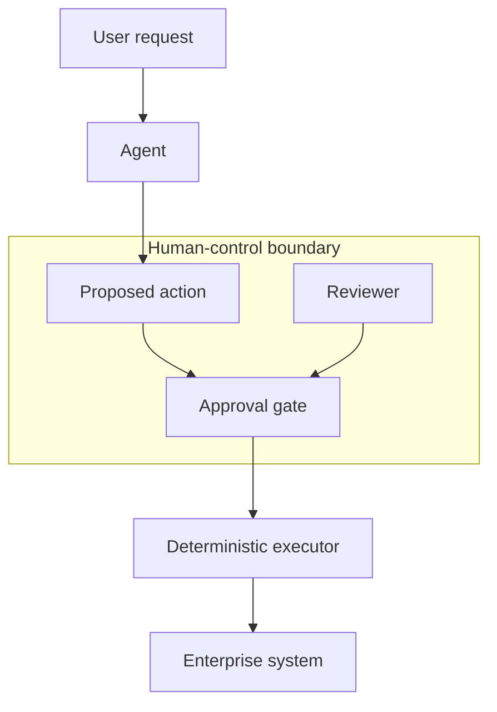

## 5. Enterprise agent memory
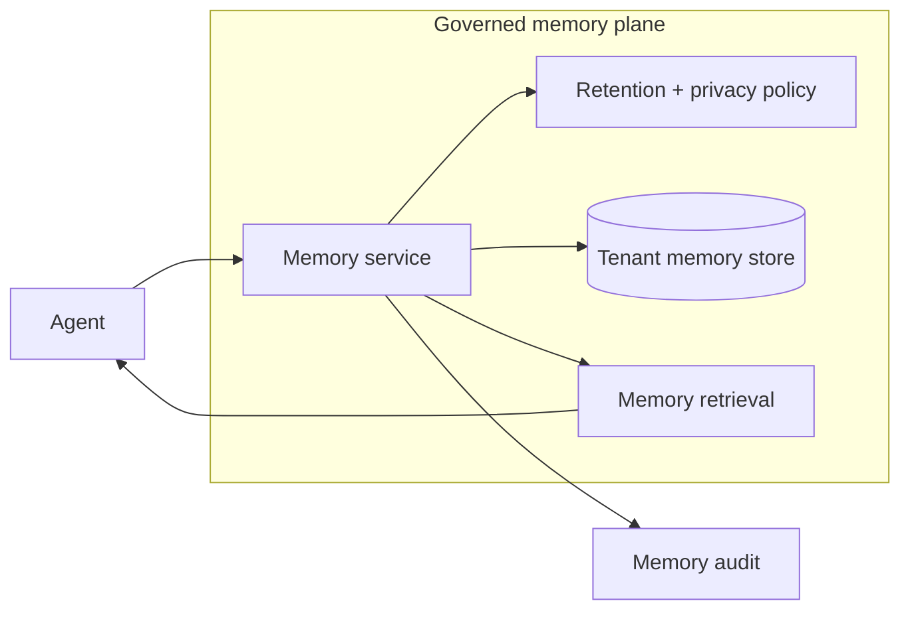

## 6. Multi-agent supervisor
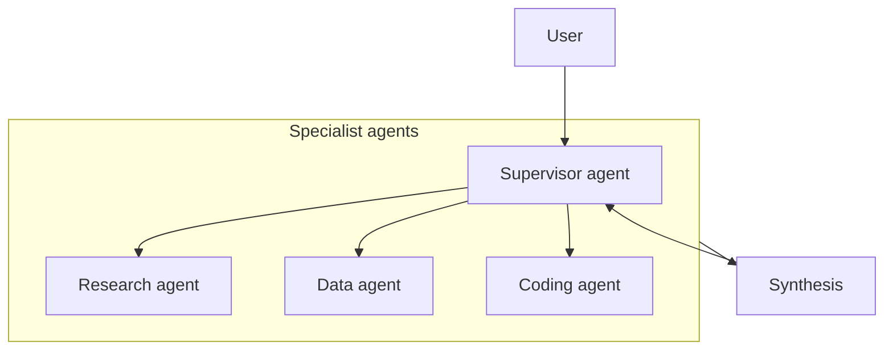

## 7. Model serving platform
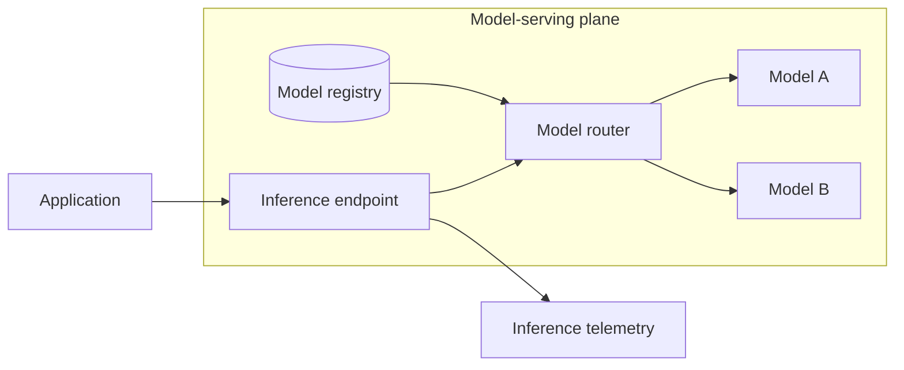

## 8. Prompt management platform
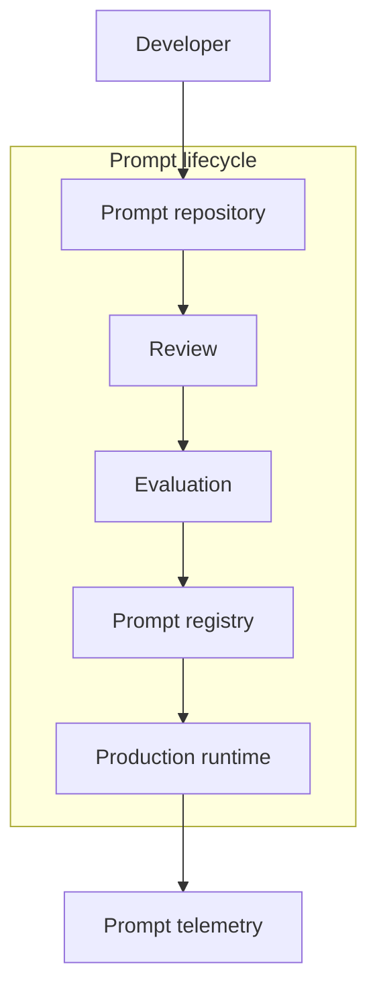

## 9. AI evaluation platform
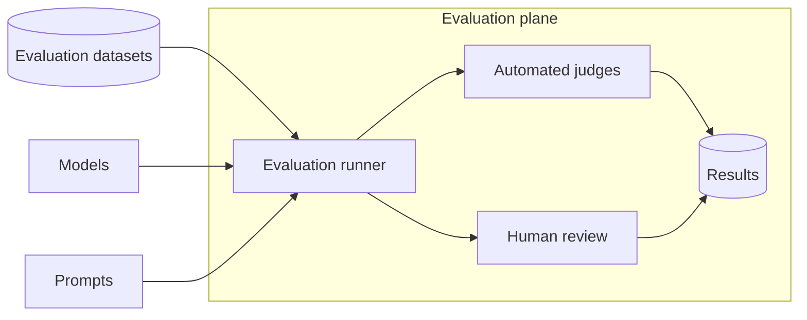

## 10. AI red-team environment
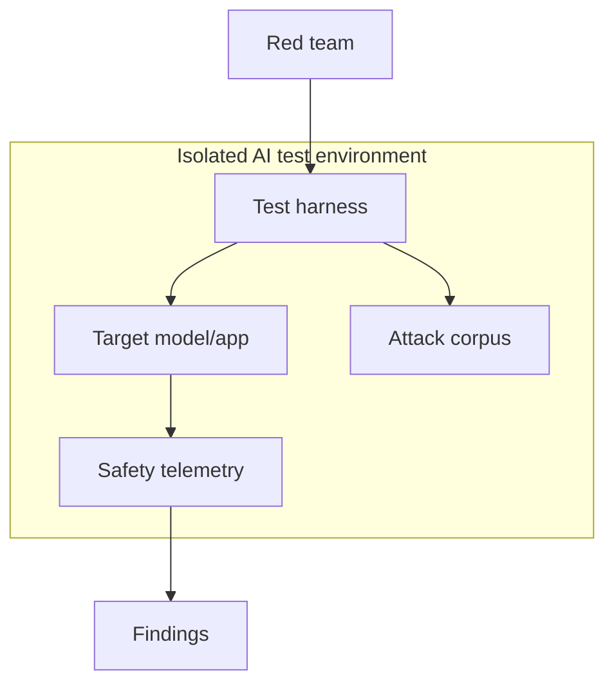

## 11. Agent identity delegation
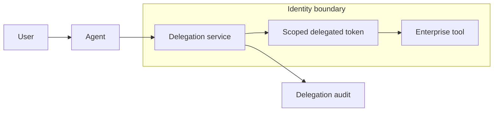

## 12. Agent sandbox execution
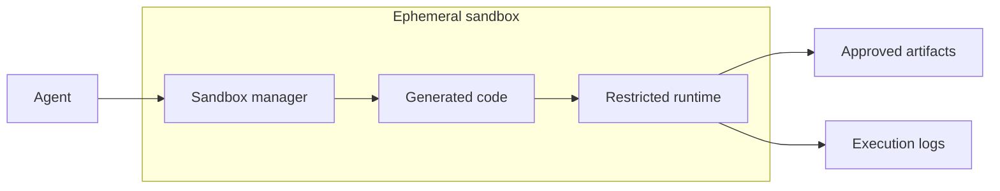

## 13. AI data-loss prevention
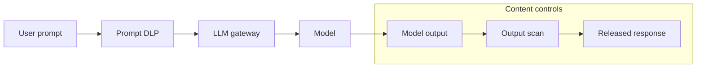

## 14. Retrieval authorization filter
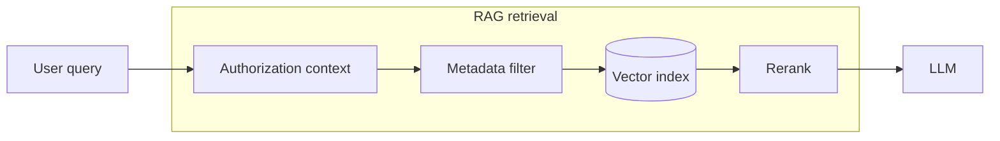

## 15. Model fallback routing
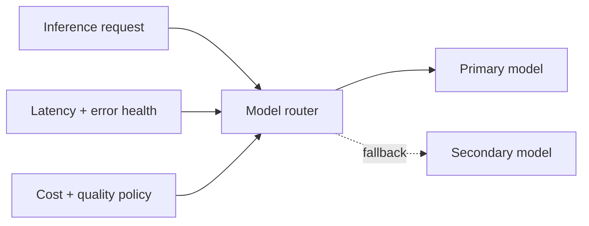

## 16. Agent observability
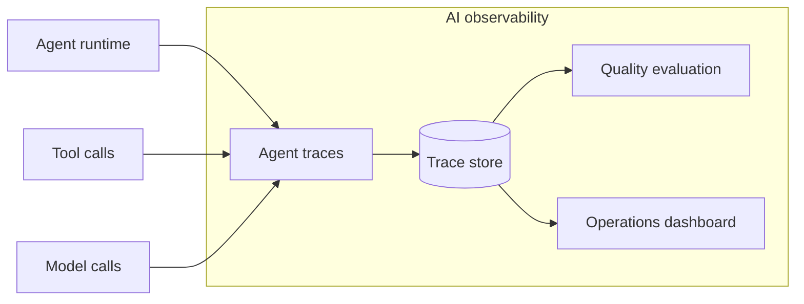

## 17. Enterprise knowledge ingestion
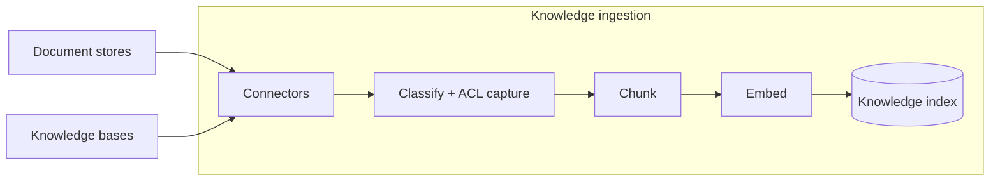

## 18. AI policy decision service
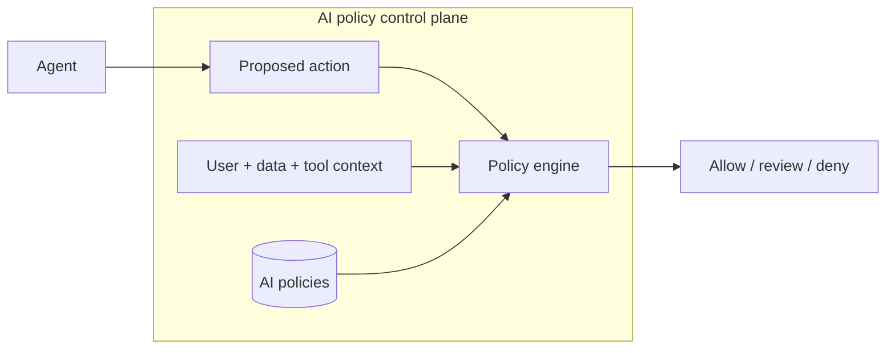

## 19. Agent skills distribution
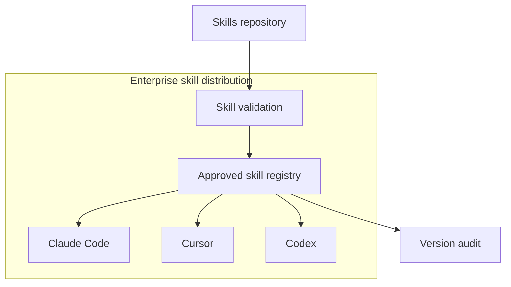

## 20. LLMOps release architecture
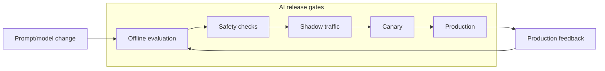