# Enterprise Cloud Networking Architecture Examples

## 1. Public ingress to private services
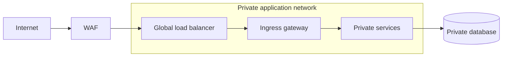

## 2. Controlled enterprise egress
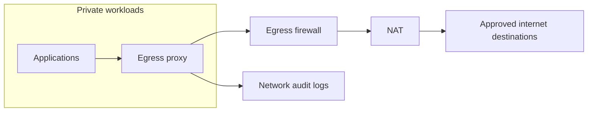

## 3. Hub-and-spoke cloud network
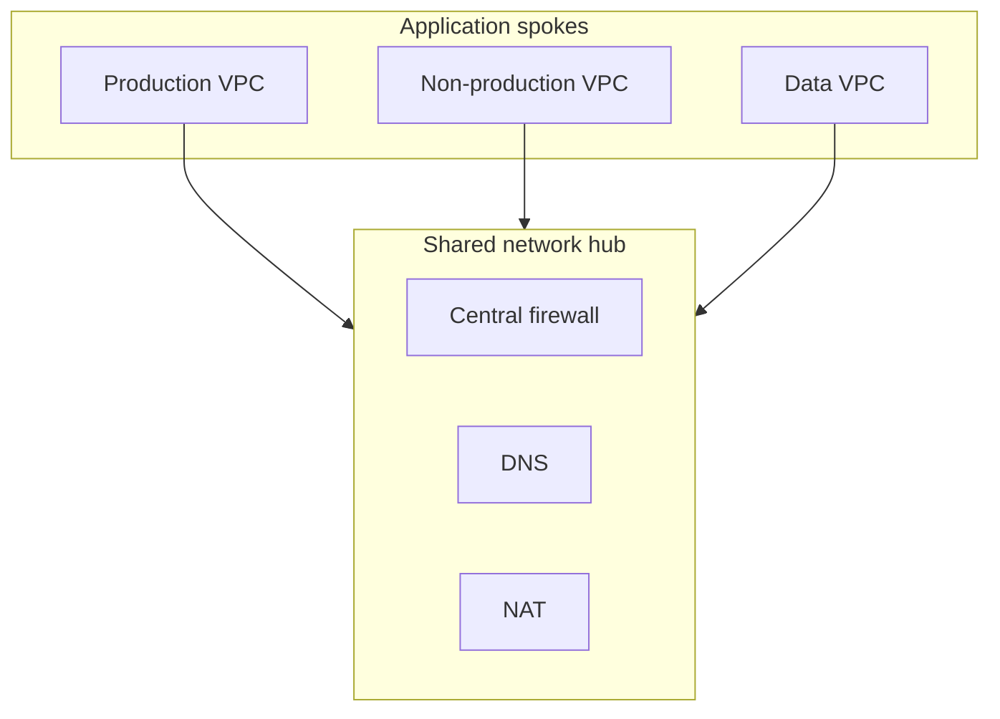

## 4. Hybrid corporate connectivity
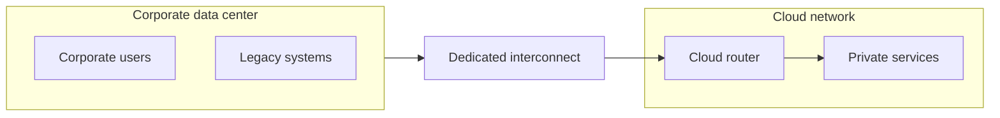

## 5. Active-active global regions
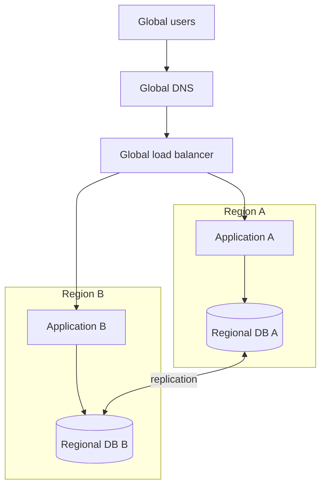

## 6. Active-passive regional failover
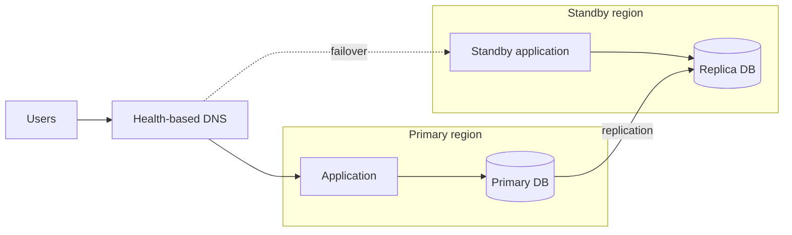

## 7. Private service access
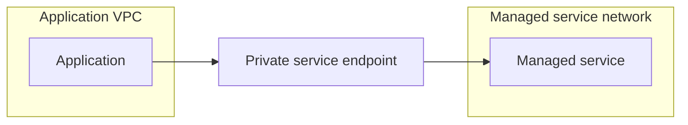

## 8. Shared DNS architecture
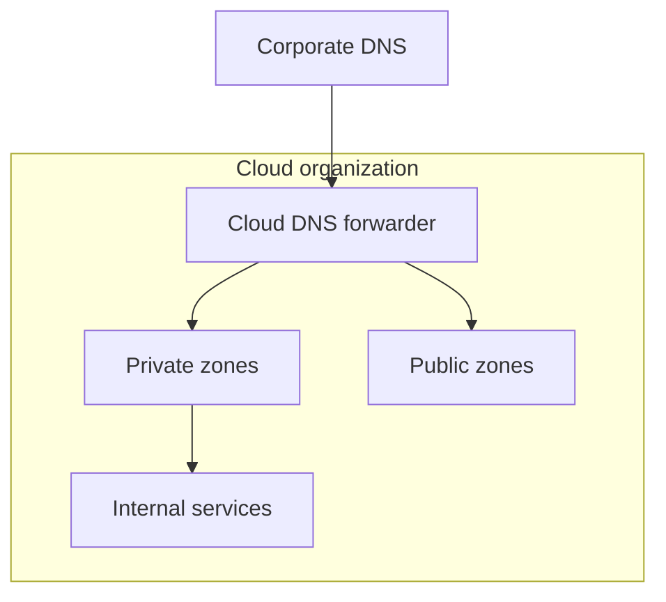

## 9. Partner extranet boundary
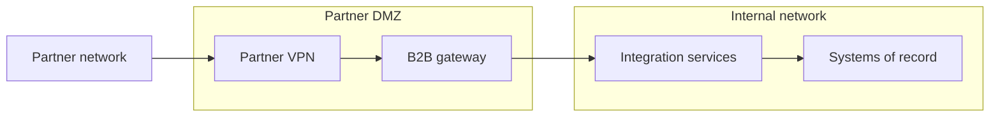

## 10. Service mesh traffic boundary
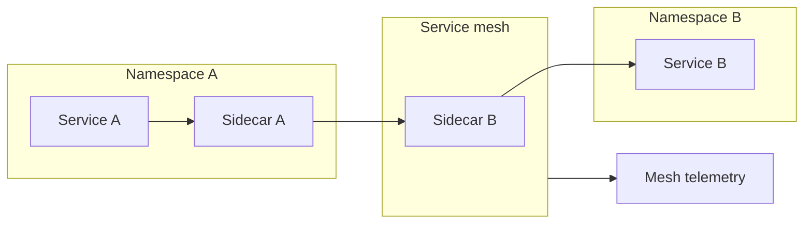

## 11. Multi-cloud private connectivity
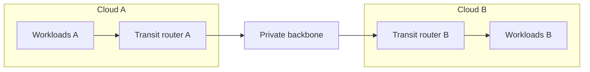

## 12. Centralized inspection VPC
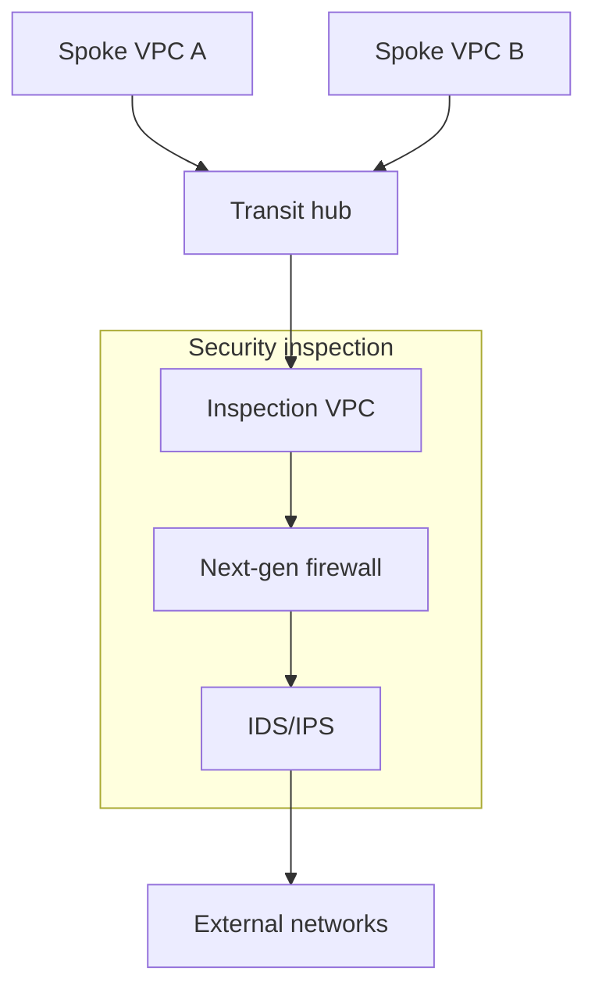

## 13. Private API exposure
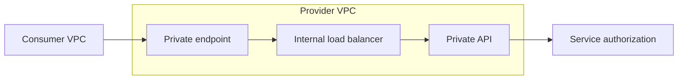

## 14. Internet-facing SaaS edge
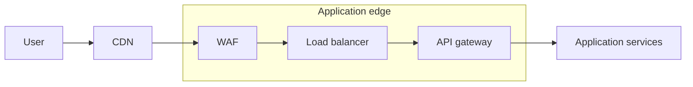

## 15. Regional data residency routing
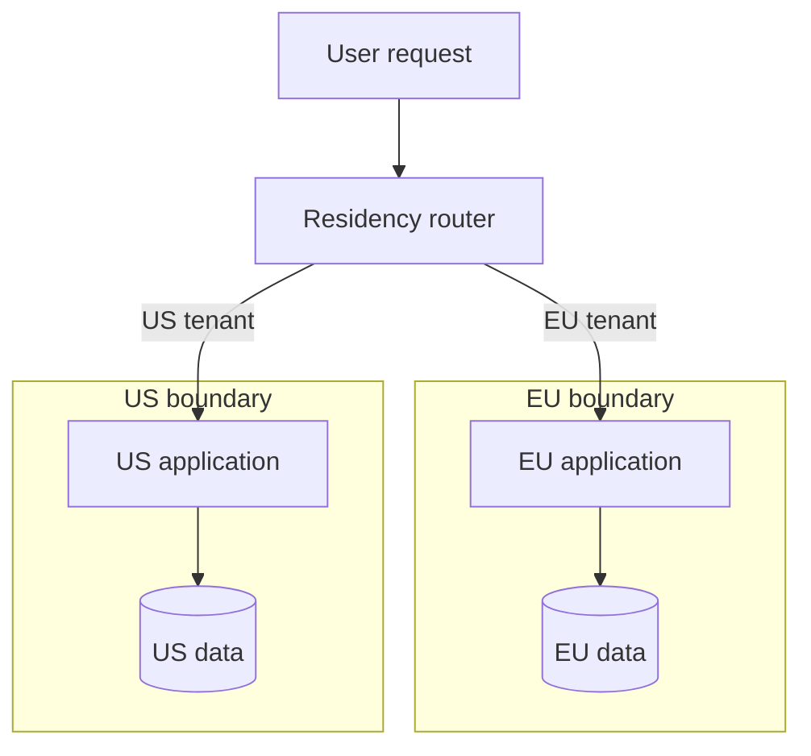

## 16. Bastionless administration
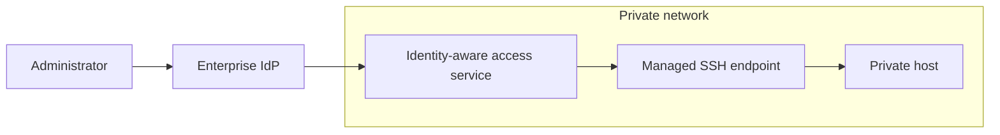

## 17. Layer-7 east-west gateway
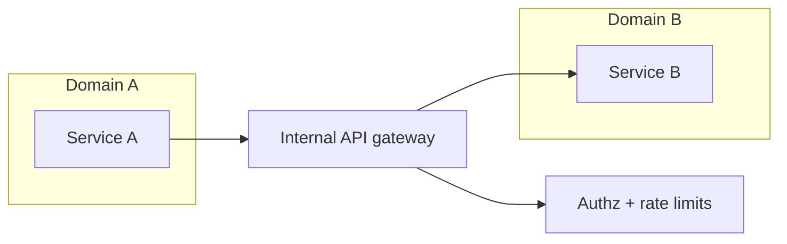

## 18. Network telemetry architecture
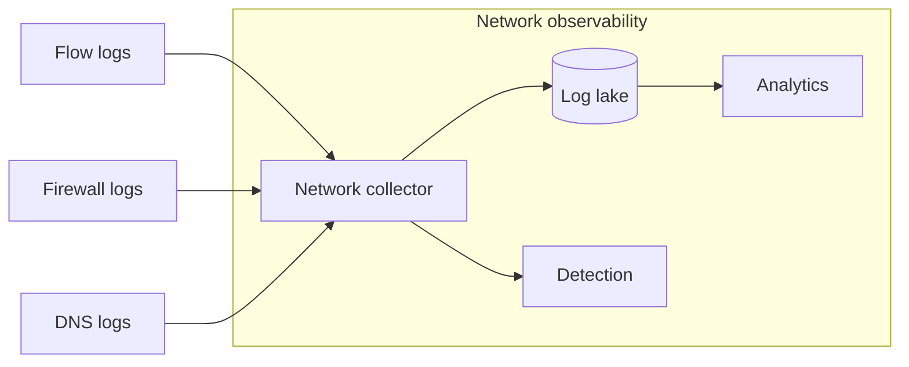

## 19. Split-horizon application access
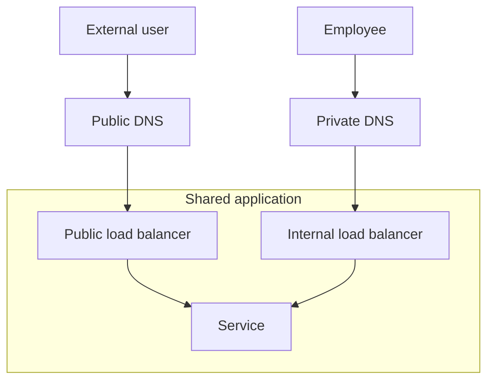

## 20. API gateway per security zone
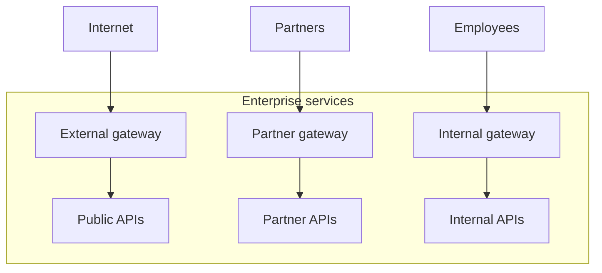