# Enterprise Data and Analytics Architecture Examples

## 1. Modern warehouse platform
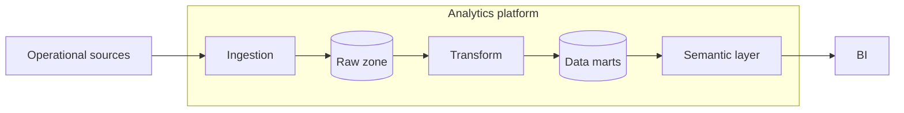

## 2. Lakehouse medallion
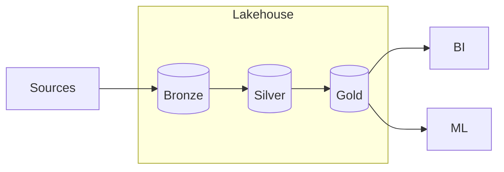

## 3. Enterprise data mesh
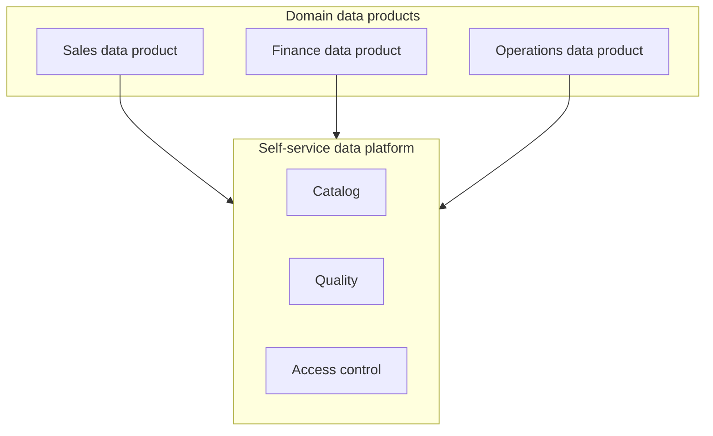

## 4. Semantic layer architecture
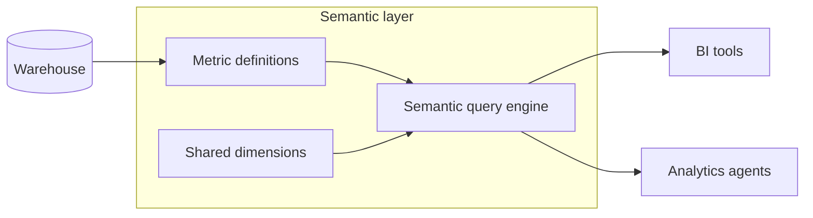

## 5. Data catalog and lineage
```mermaid
flowchart LR
  warehouse[Warehouse metadata] --> collector[Metadata collectors]
  dbt[Transformation metadata] --> collector
  bi[BI metadata] --> collector
  subgraph catalog[Enterprise catalog]
    collector --> graph[(Lineage graph)]
    graph --> search[Search]
    graph --> impact[Impact analysis]
  end
```

## 6. Streaming analytics
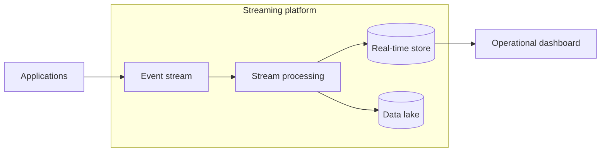

## 7. CDC analytics pipeline
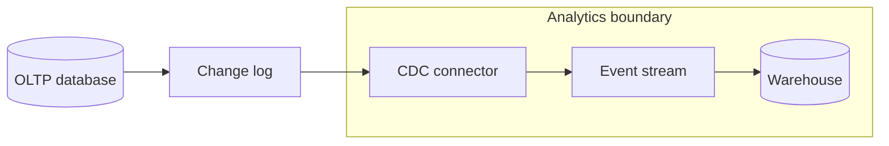

## 8. Governed data sharing
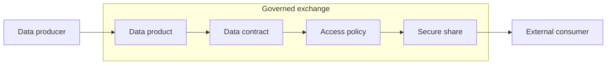

## 9. PII processing boundary
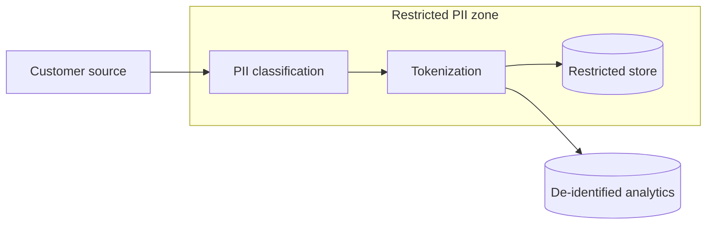

## 10. Data quality platform
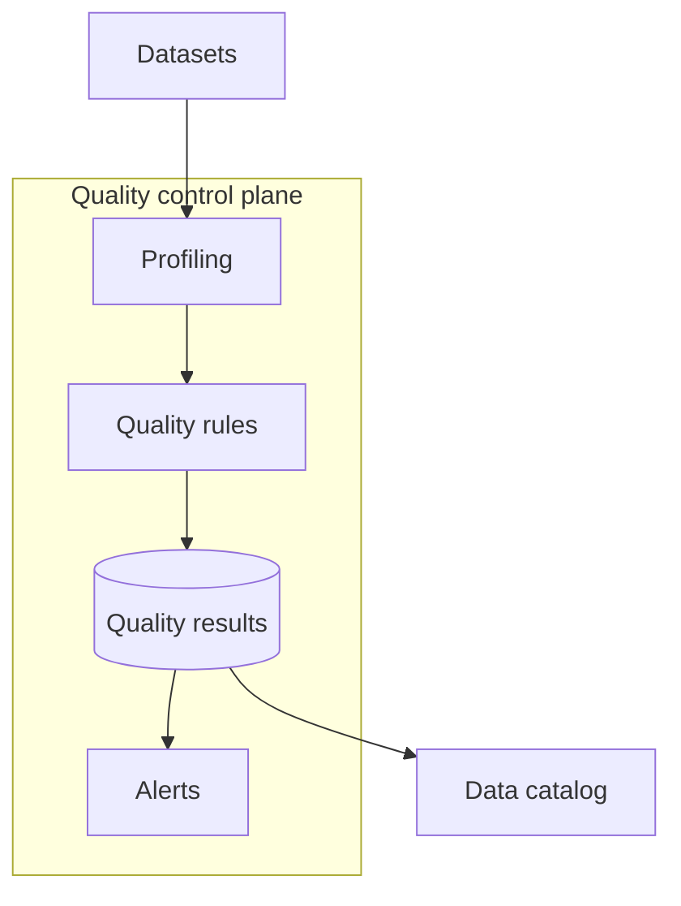

## 11. Federated query architecture
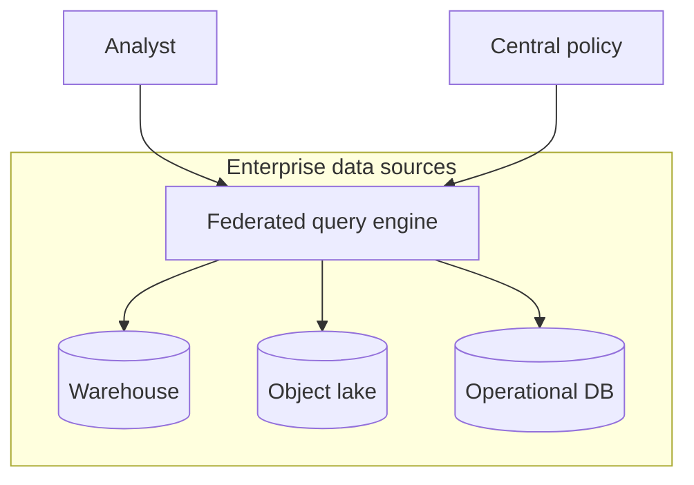

## 12. Reverse ETL
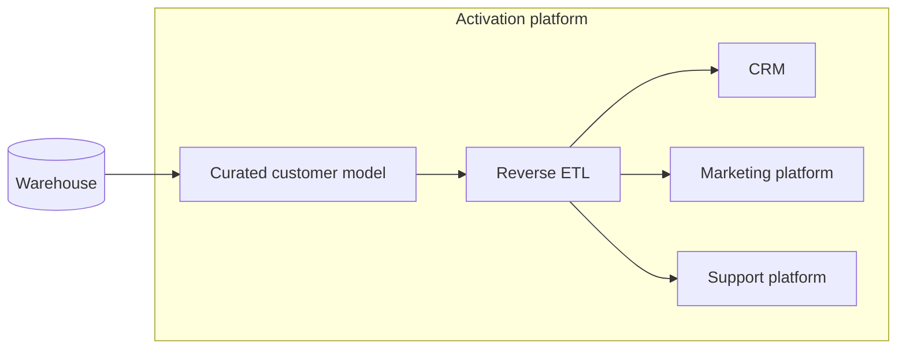

## 13. Enterprise feature store
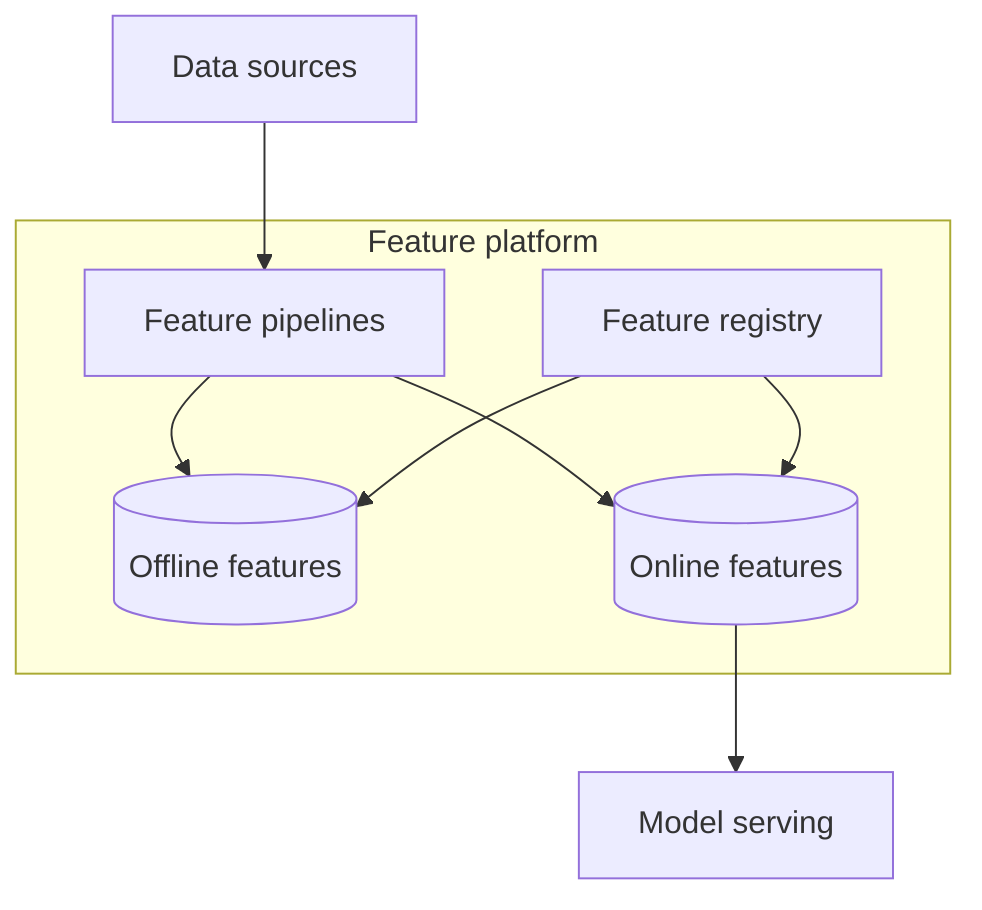

## 14. Batch orchestration platform
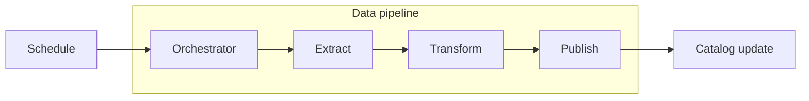

## 15. Data contract enforcement
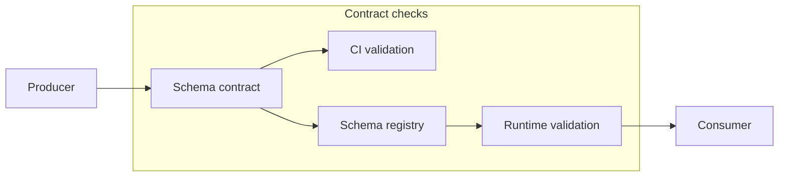

## 16. Analytics sandbox isolation
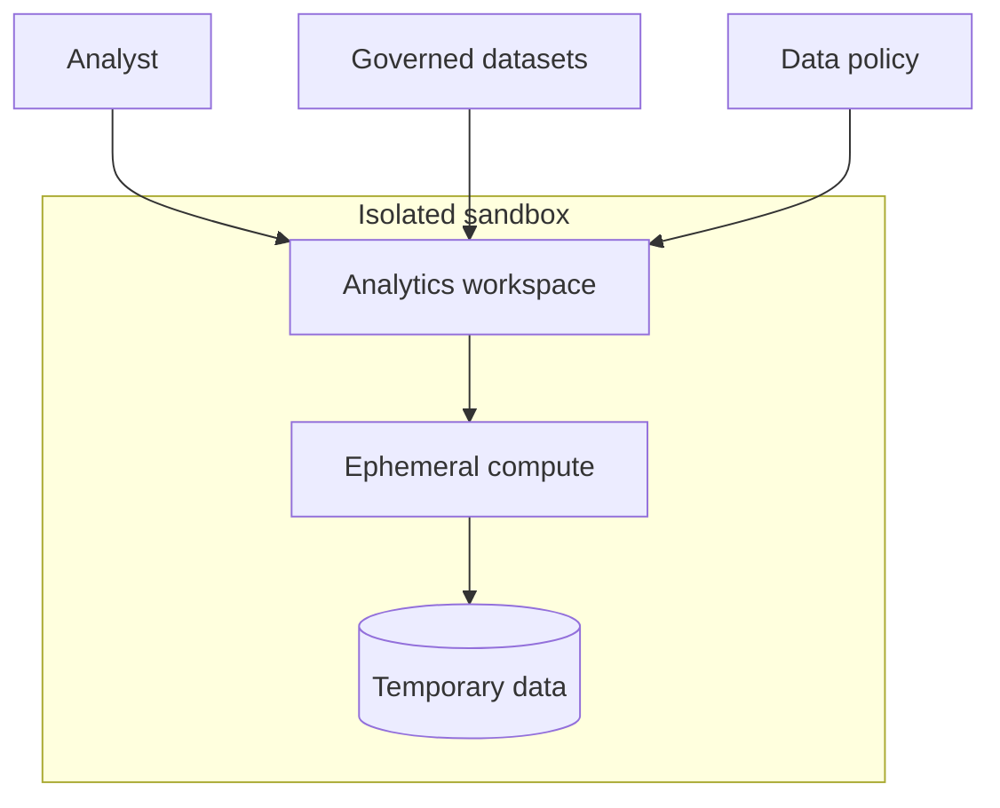

## 17. Metrics observability
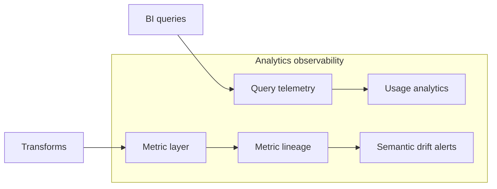

## 18. Data retention tiers
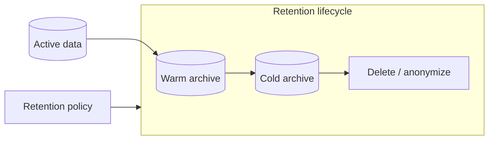

## 19. Multi-region analytics residency
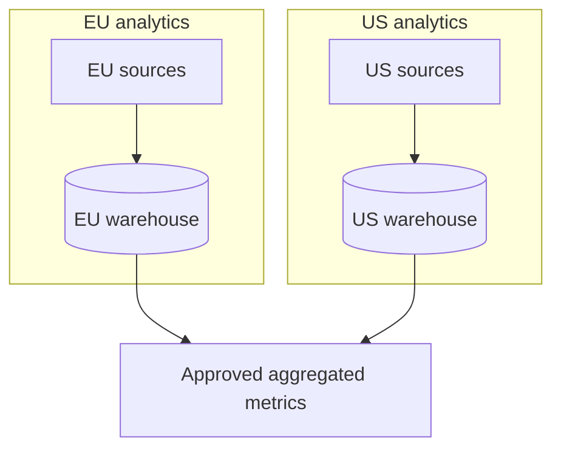

## 20. Agentic analytics platform
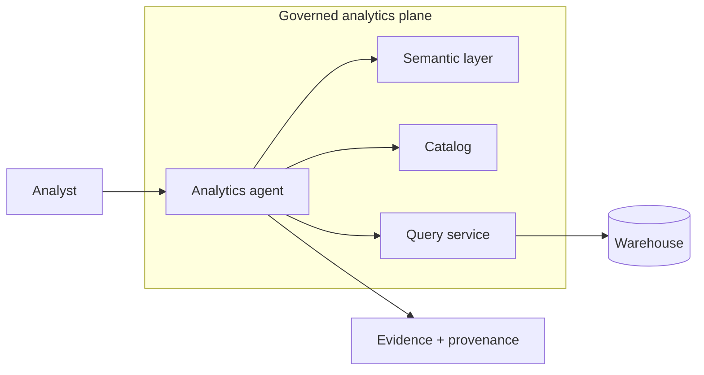