# Enterprise Platform Architecture Examples

## 1. Internal developer platform
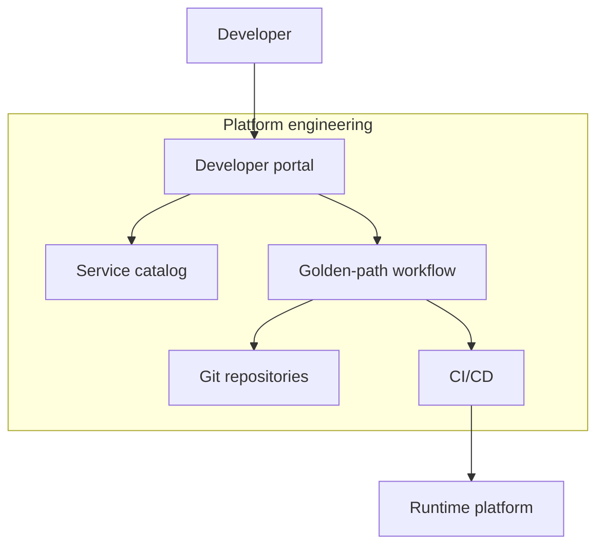

## 2. Shared services backbone
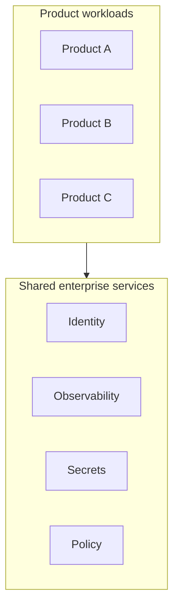

## 3. Enterprise SaaS control and data plane
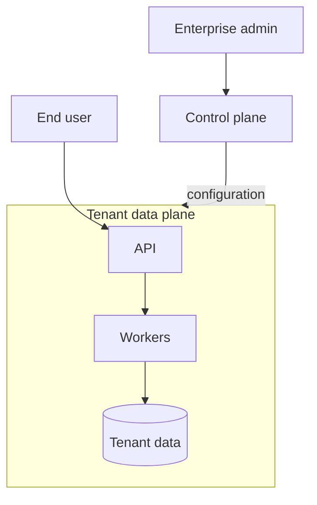

## 4. Multi-tenant application with isolation
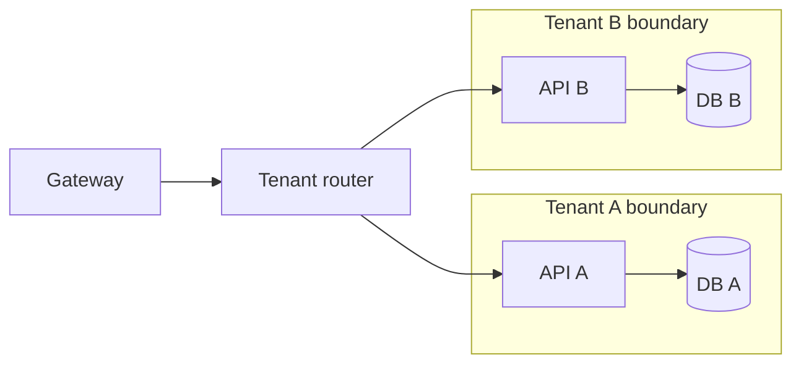

## 5. Platform API facade
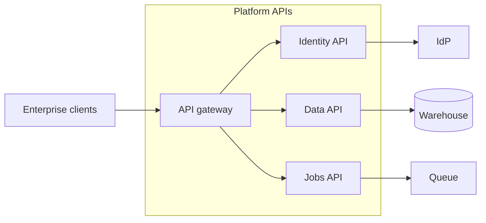

## 6. Business capability domains
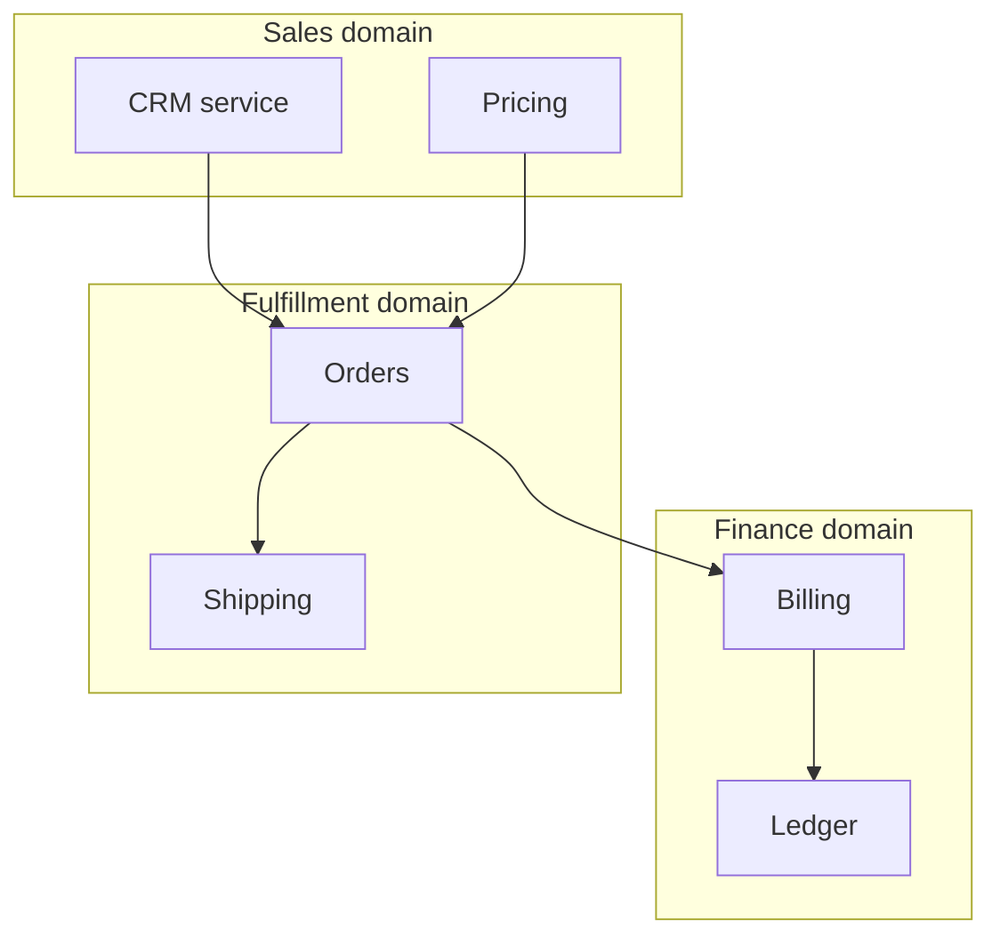

## 7. Enterprise portal composition
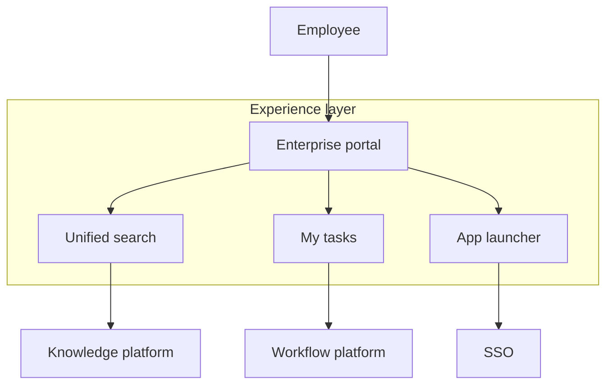

## 8. Headless enterprise platform
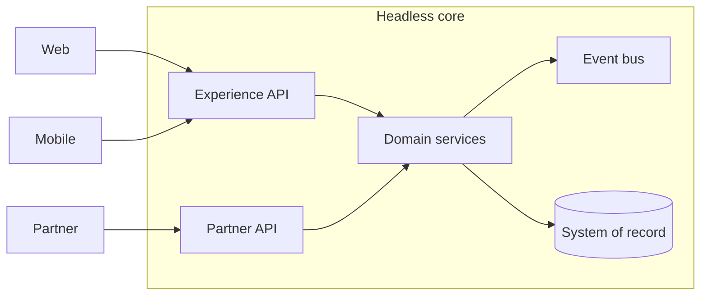

## 9. Product plus shared control plane
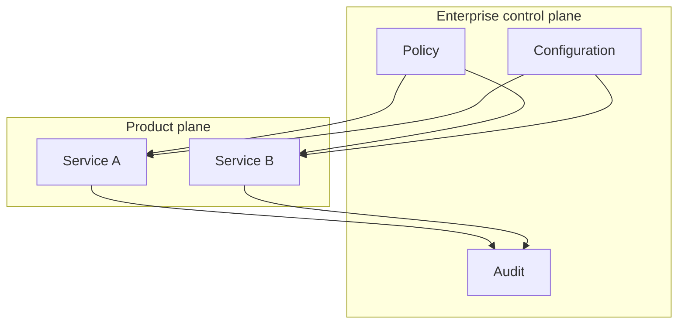

## 10. Platform engineering team topology
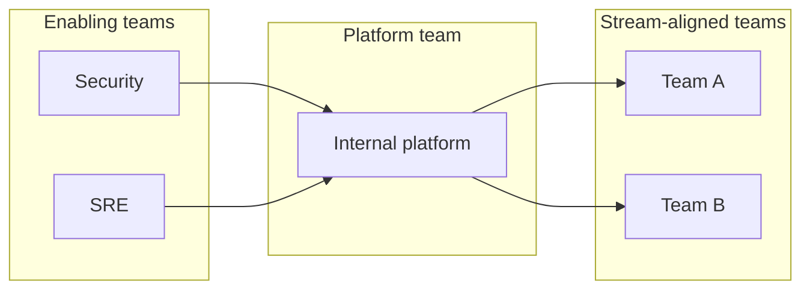

## 11. Enterprise integration platform
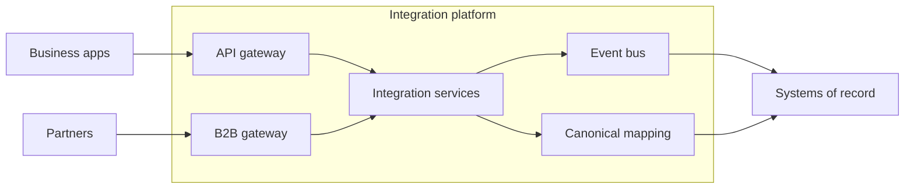

## 12. Self-service environment provisioning
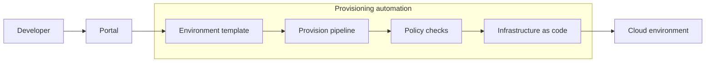

## 13. Enterprise feature platform
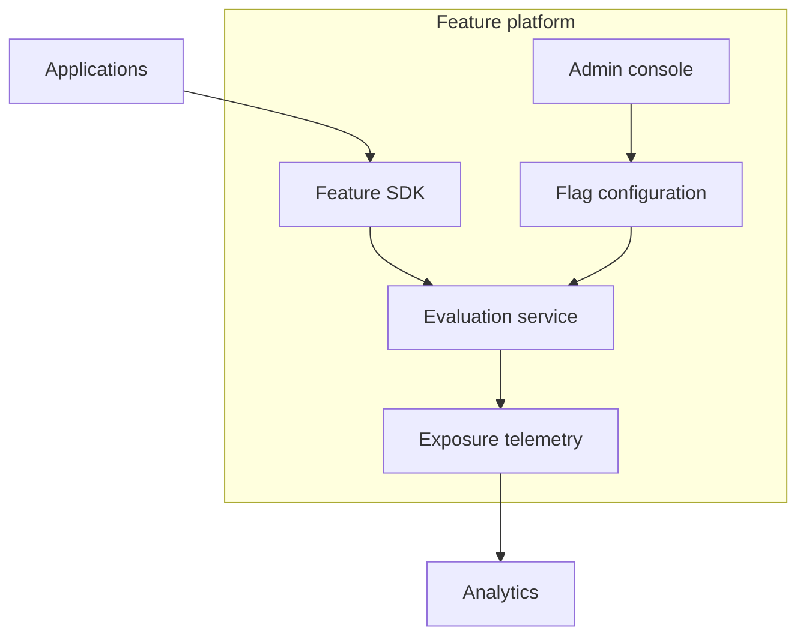

## 14. Centralized notification platform
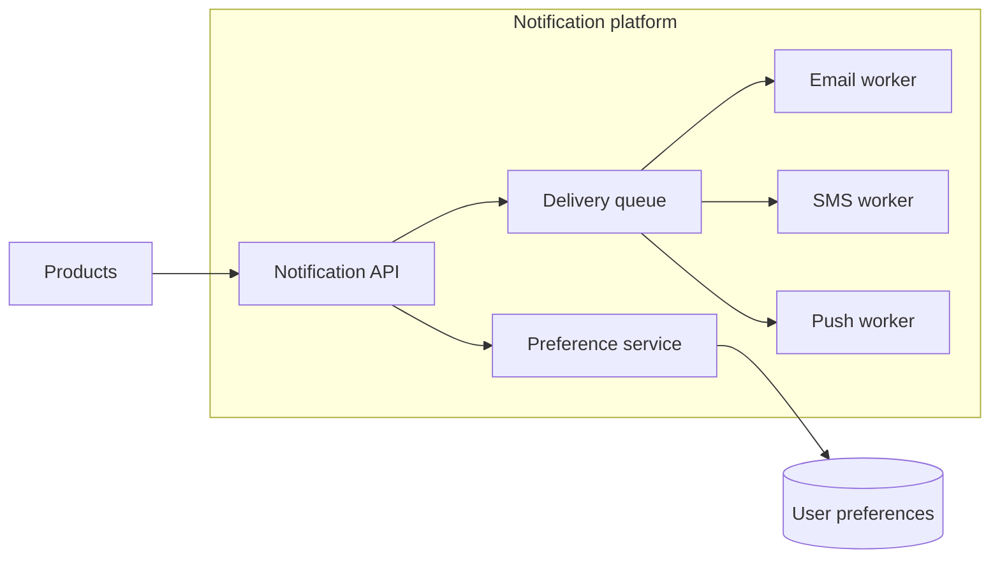

## 15. Enterprise search platform
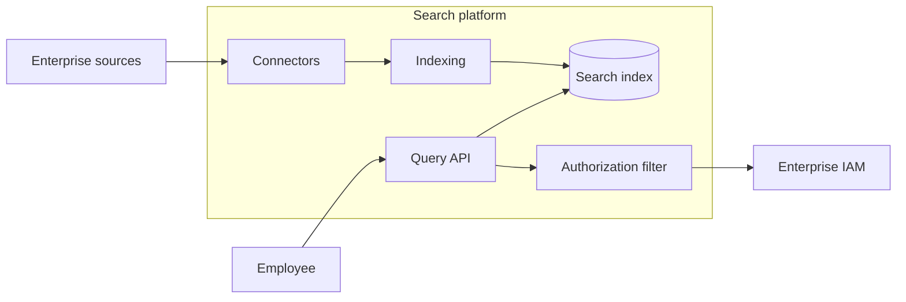

## 16. Configuration management platform
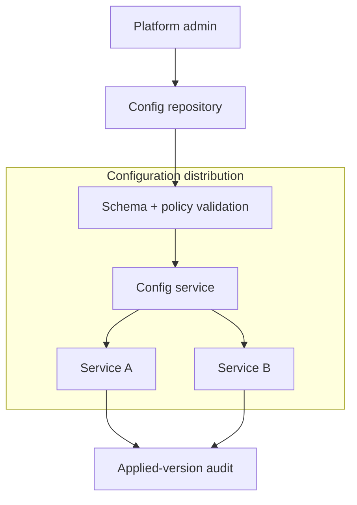

## 17. Enterprise scheduler platform
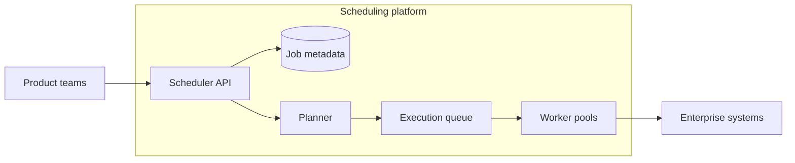

## 18. Enterprise document processing
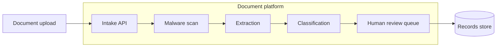

## 19. Central audit platform
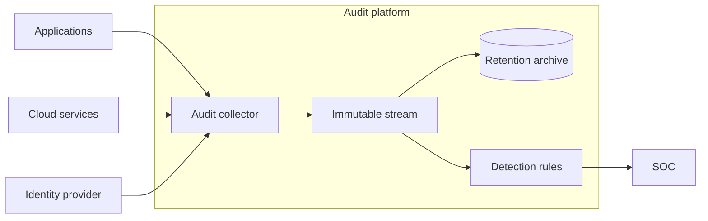

## 20. Enterprise service catalog
```mermaid
flowchart TB
  repos[Source repositories] --> discovery[Metadata discovery]
  cloud[Cloud inventory] --> discovery
  subgraph catalog[Enterprise catalog]
    discovery --> catalogDb[(Catalog)]
    catalogDb --> portal[Catalog portal]
    catalogDb --> graph[Dependency graph]
  end
  owner[Service owner] --> portal
  sre[SRE] --> graph
```