# Enterprise Governance and Compliance Architecture Examples

## 1. Data residency boundary
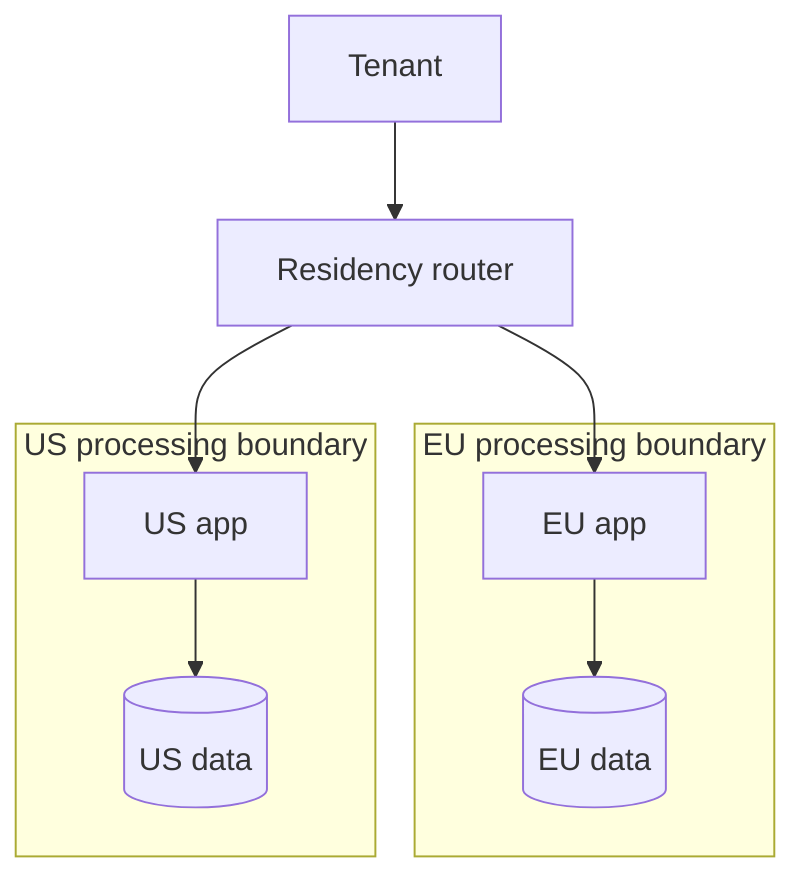

## 2. Audit evidence pipeline
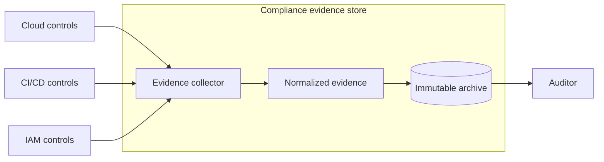

## 3. Policy hierarchy
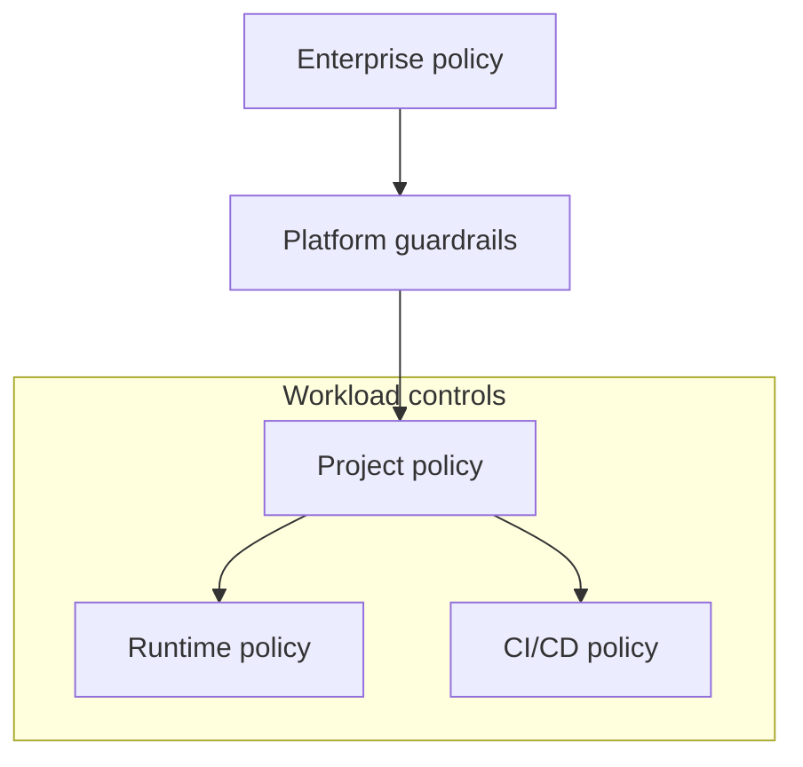

## 4. Segregation of duties
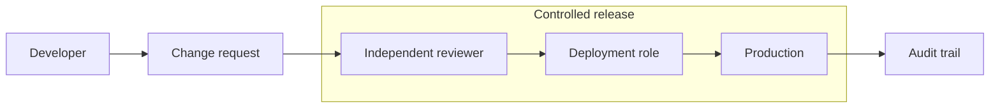

## 5. Tenant control plane separation
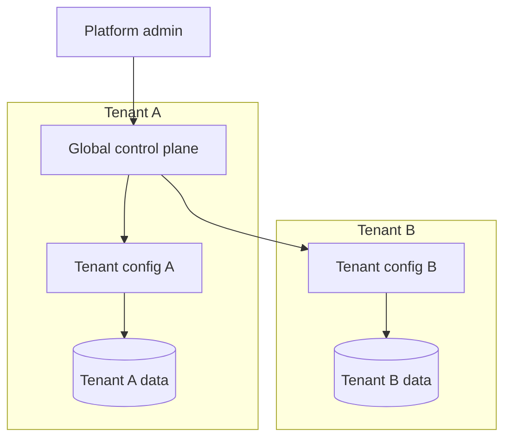

## 6. Retention policy enforcement
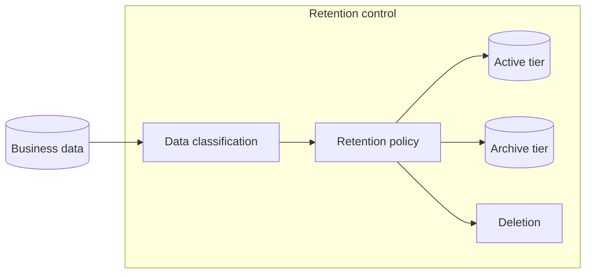

## 7. Legal hold architecture
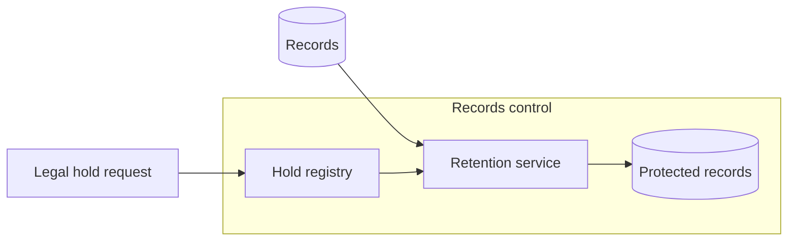

## 8. Privacy request processing architecture
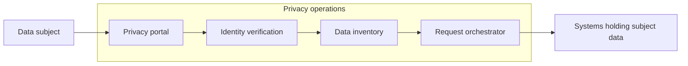

## 9. Consent management architecture
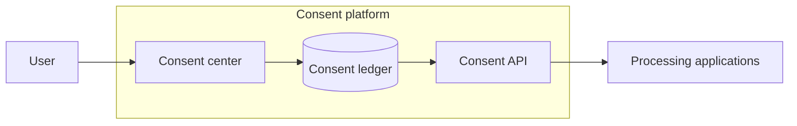

## 10. Enterprise risk register integration
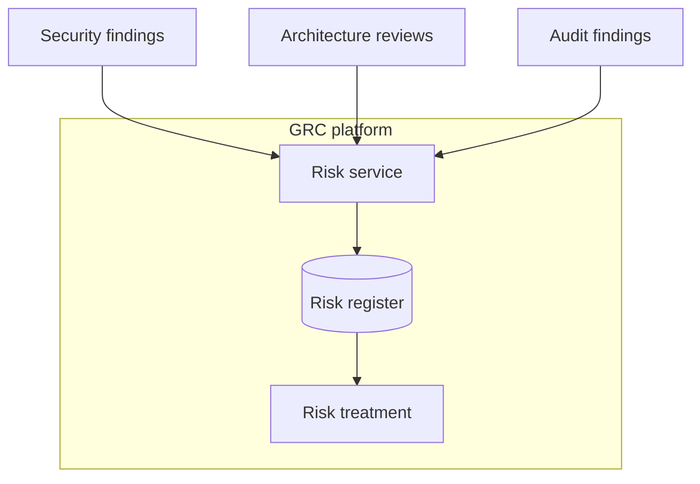

## 11. Control mapping architecture
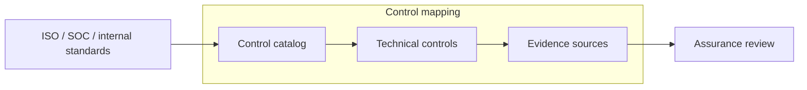

## 12. Cloud organization guardrails
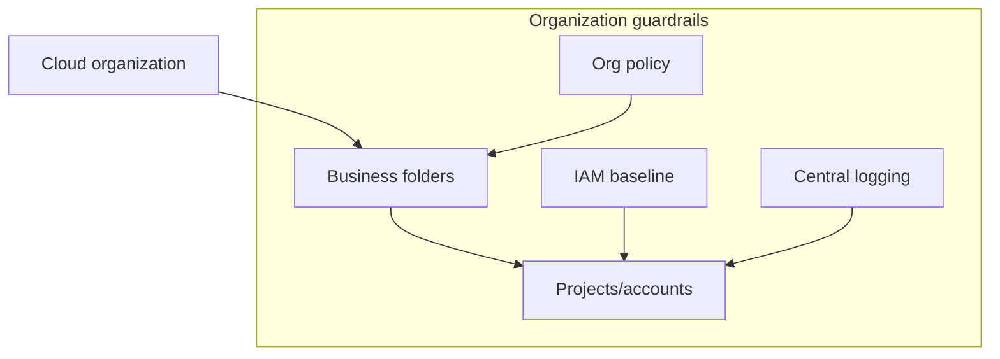

## 13. Environment separation
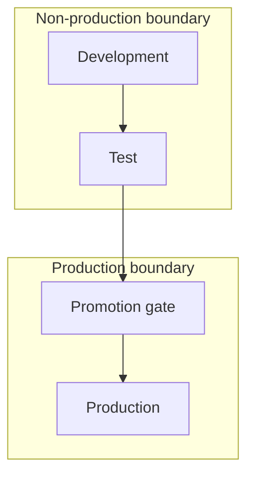

## 14. Controlled data export
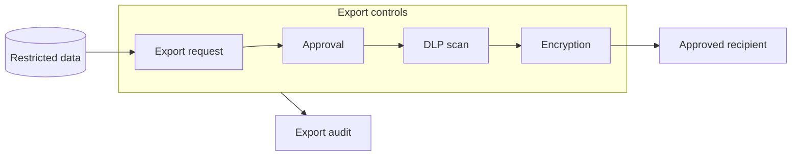

## 15. Vendor access boundary
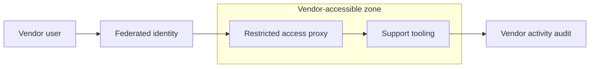

## 16. Compliance monitoring control loop
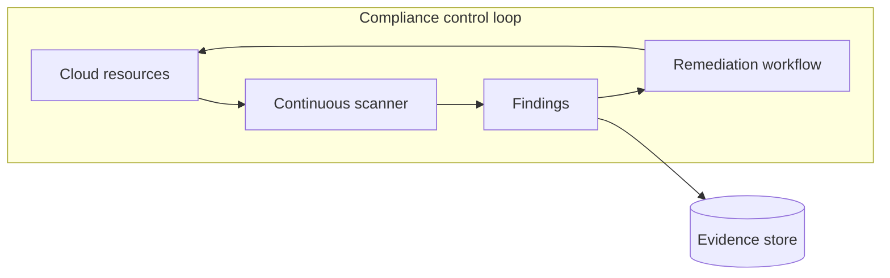

## 17. Data classification architecture
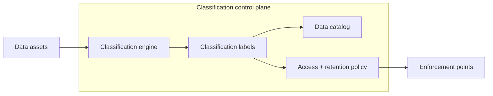

## 18. Enterprise exception lifecycle architecture
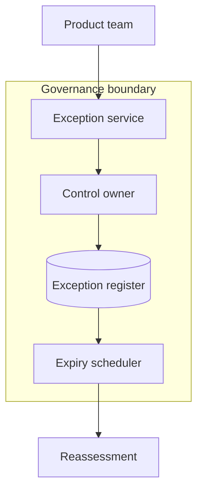

## 19. Immutable audit logging
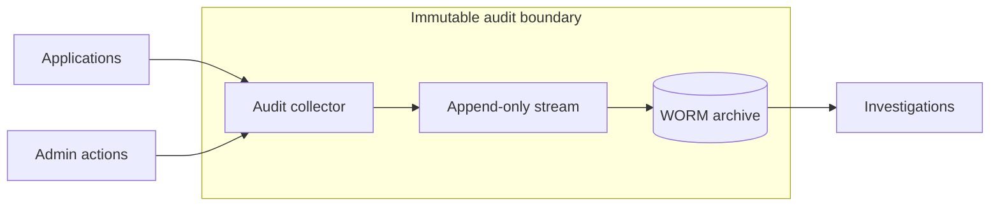

## 20. Compliance reporting platform
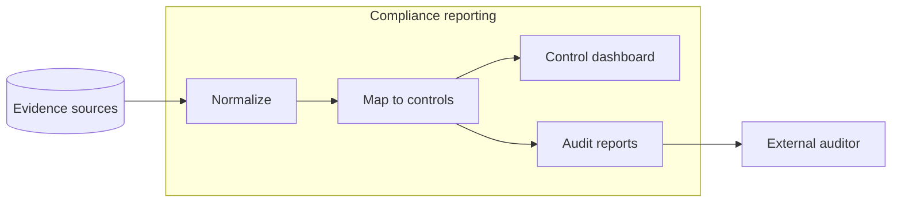