# Enterprise Identity and Security Architecture Examples

## 1. Workforce SSO boundary
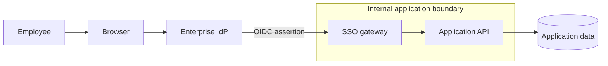

## 2. Zero-trust access proxy
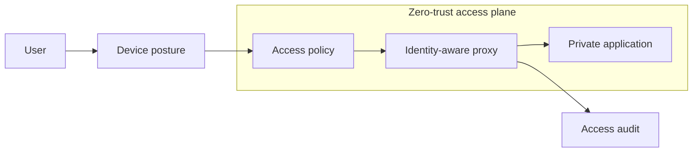

## 3. Service-to-service workload identity
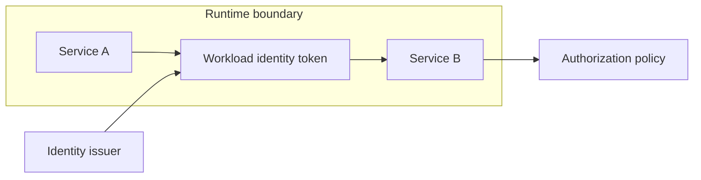

## 4. Privileged access management
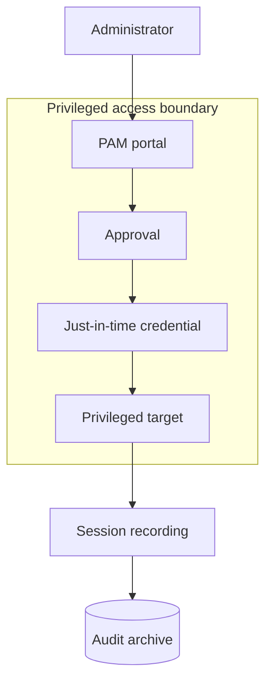

## 5. Secrets delivery with workload identity
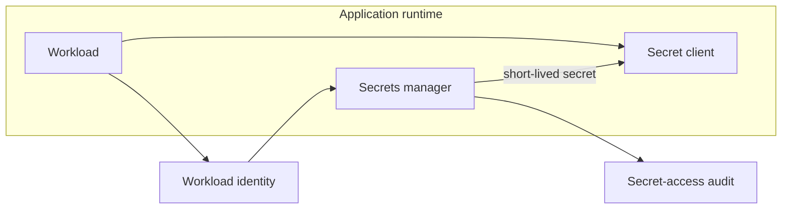

## 6. Key management hierarchy
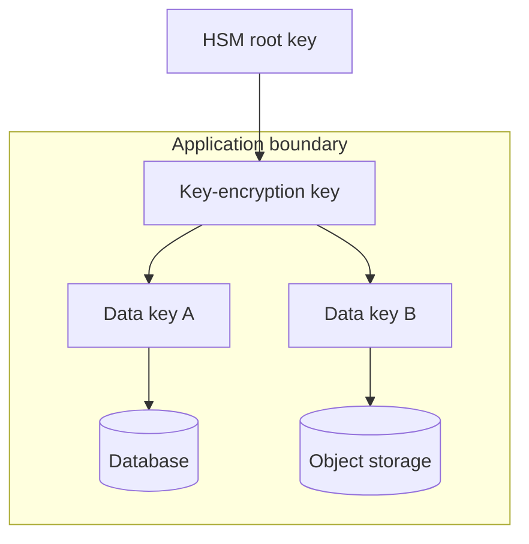

## 7. API authorization enforcement
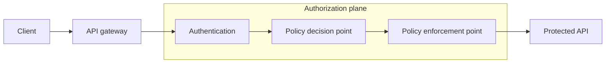

## 8. RBAC enterprise control plane
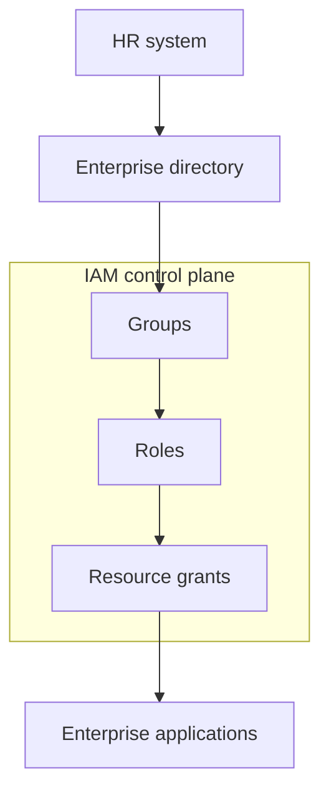

## 9. ABAC policy architecture
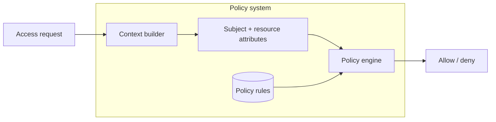

## 10. ReBAC relationship authorization
```mermaid
flowchart LR
  app[Application] --> authz[Authorization service]
  subgraph graph[Relationship graph]
    user[User] --> team[Team]
    team --> project[Project]
    project --> resource[Resource]
  end
  graph --> authz
  authz --> decision[Permission decision]
```

## 11. SCIM provisioning architecture
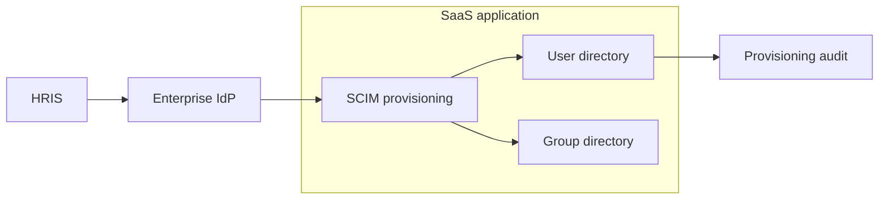

## 12. MFA enforcement path
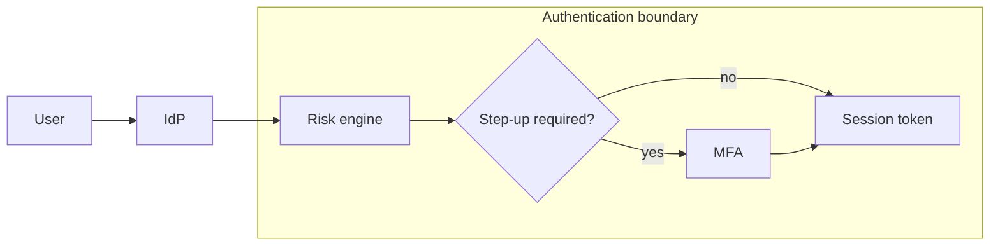

## 13. Certificate authority hierarchy
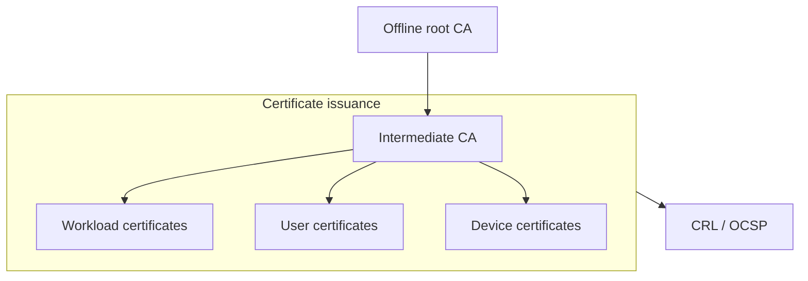

## 14. Security telemetry pipeline
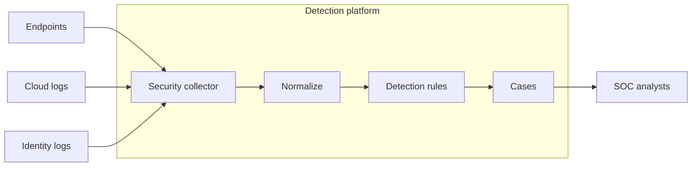

## 15. DLP enforcement architecture
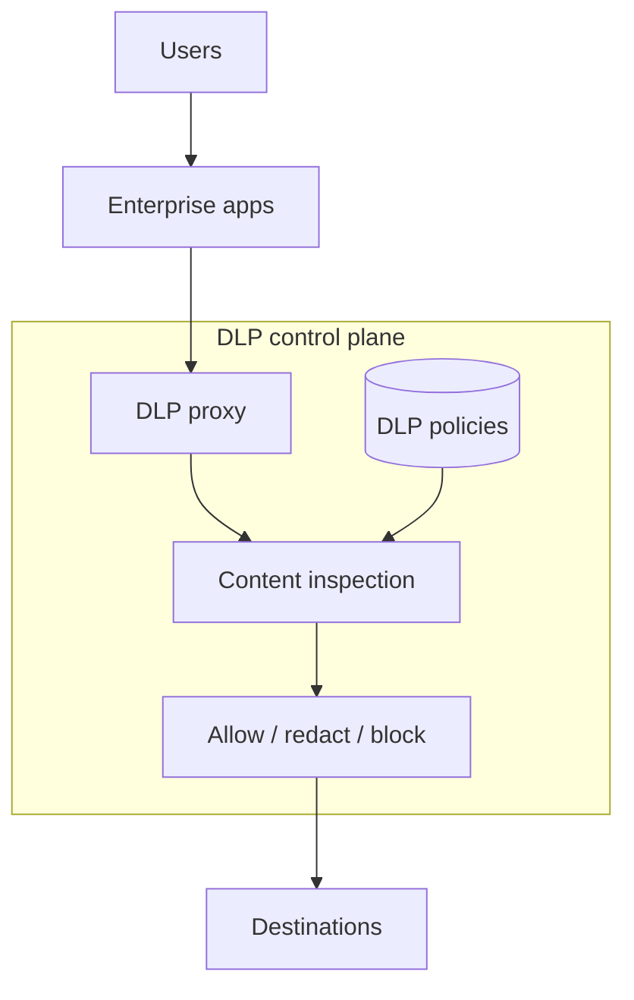

## 16. Software supply-chain trust
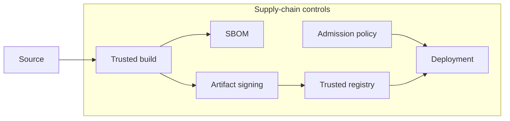

## 17. Security exception management
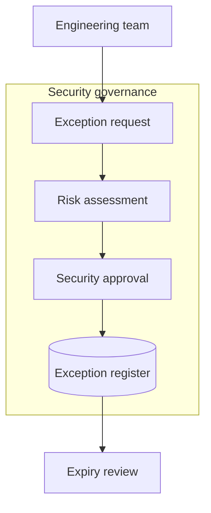

## 18. Break-glass access architecture
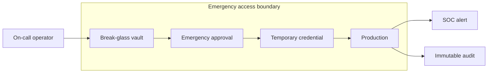

## 19. Tenant encryption isolation
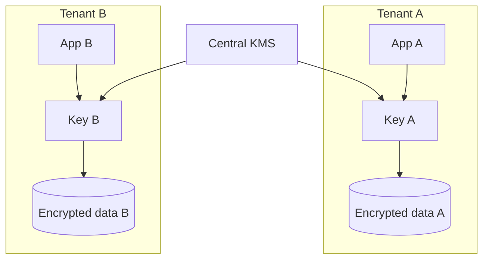

## 20. Policy-as-code enforcement
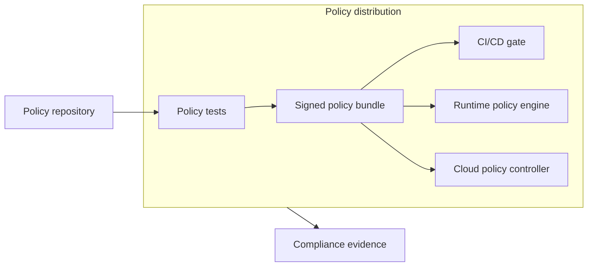