# Enterprise Integration and Messaging Architecture Examples

## 1. Event-driven backbone
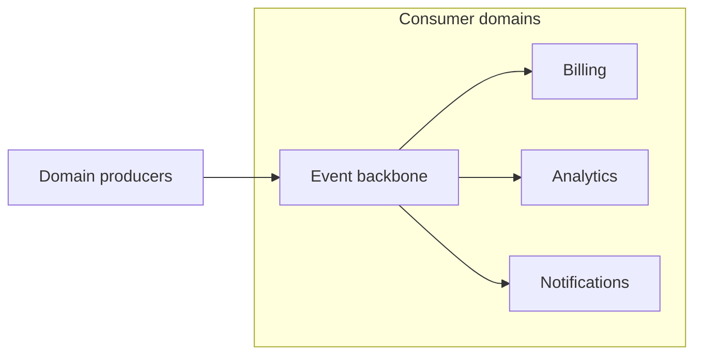

## 2. Transactional outbox
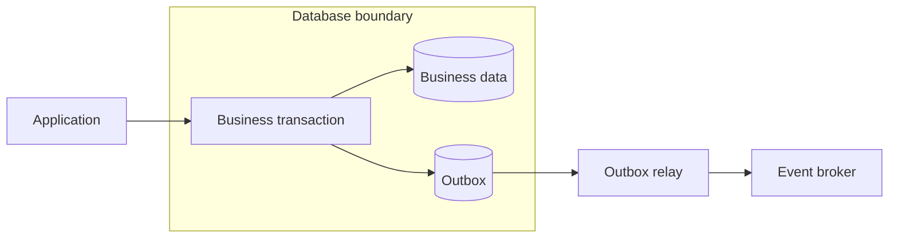

## 3. Saga orchestration
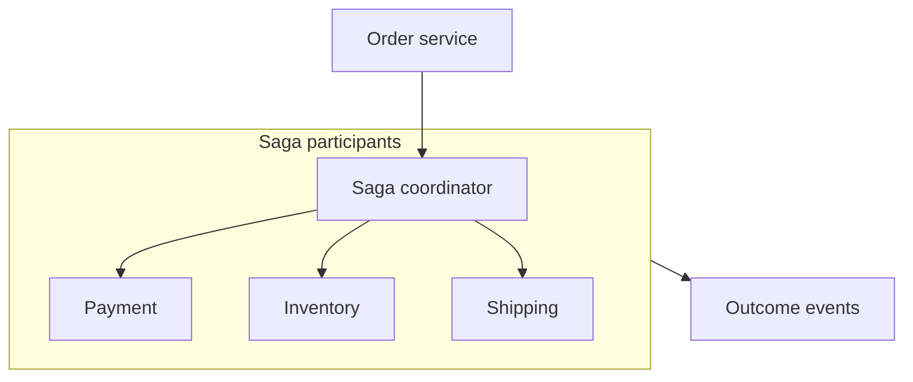

## 4. Saga choreography
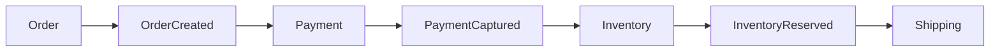

## 5. Dead-letter handling
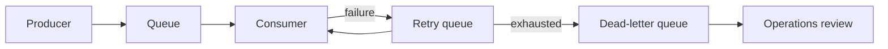

## 6. API facade over legacy systems
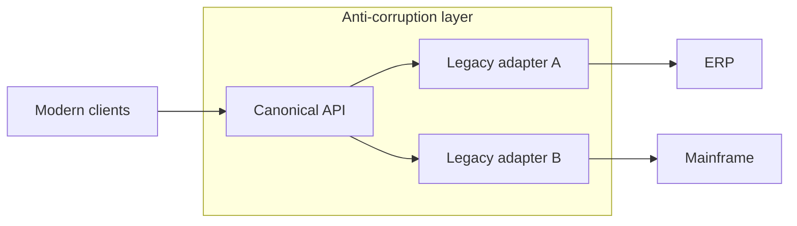

## 7. B2B managed file transfer
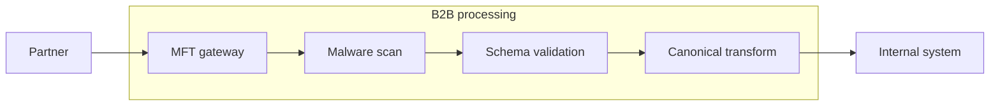

## 8. Webhook platform
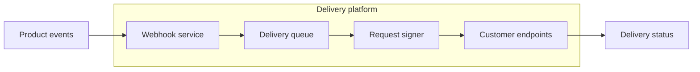

## 9. Schema registry
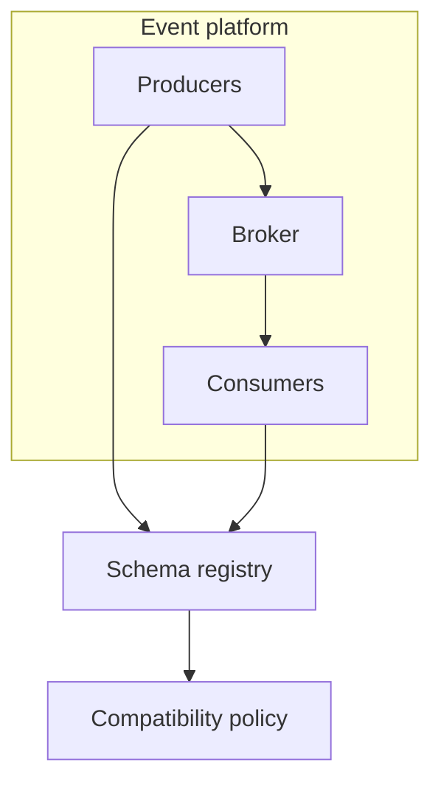

## 10. CDC integration backbone
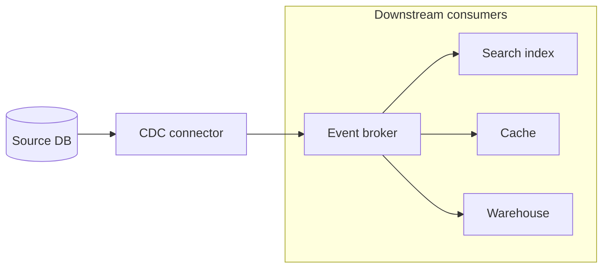

## 11. Command and query separation
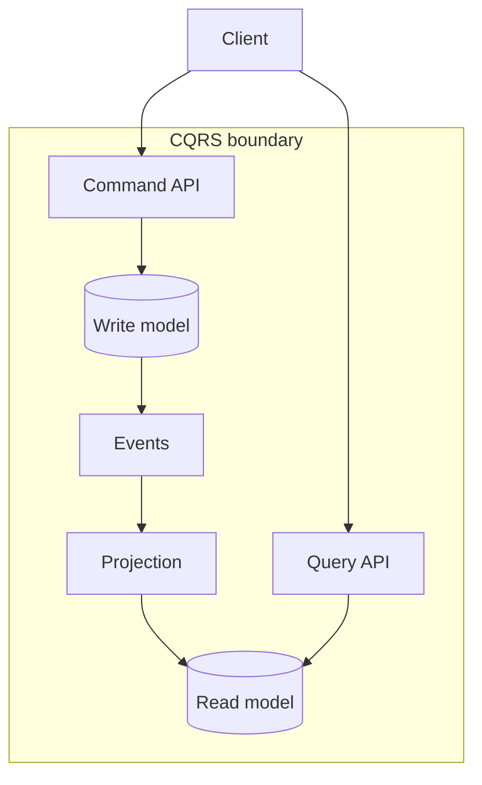

## 12. Enterprise service bus migration
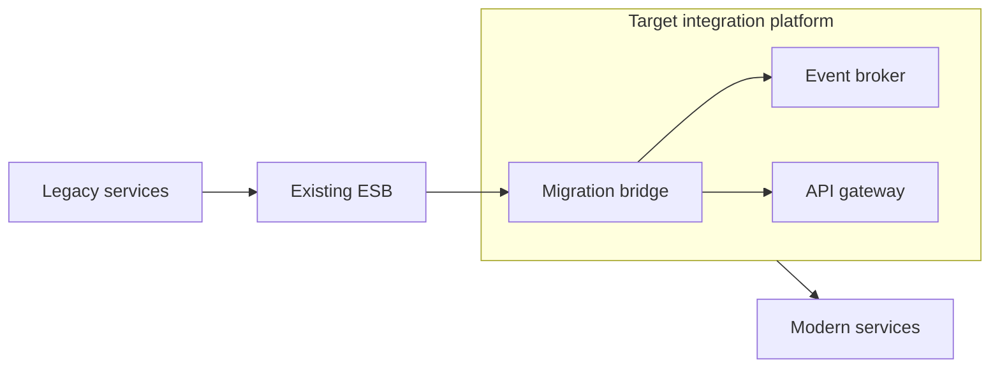

## 13. Idempotent consumer
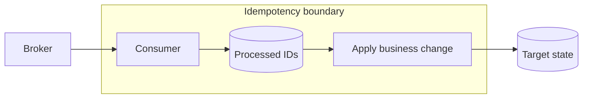

## 14. Request-reply over messaging
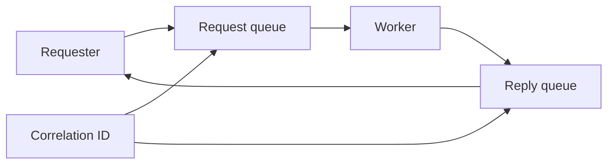

## 15. Fan-out event processing
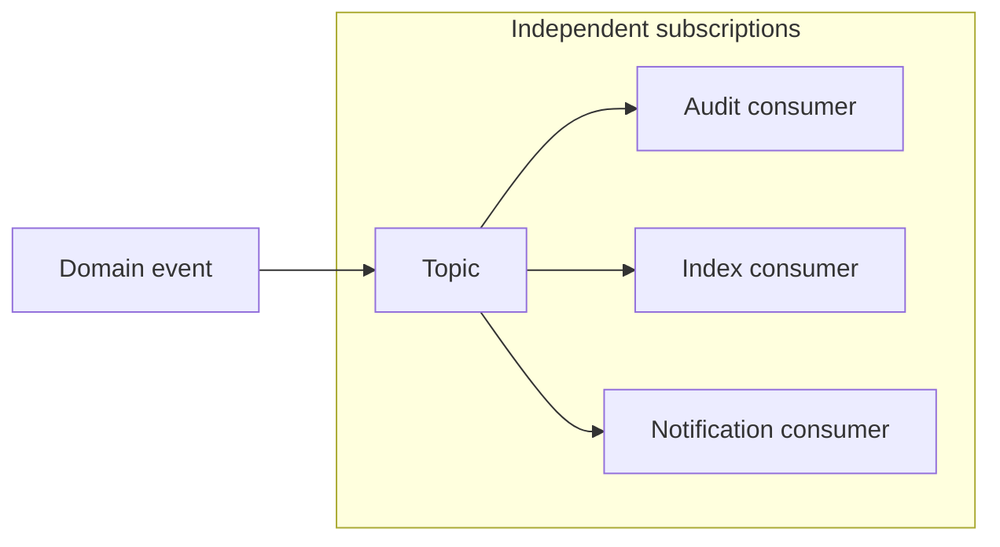

## 16. Integration rate limiting
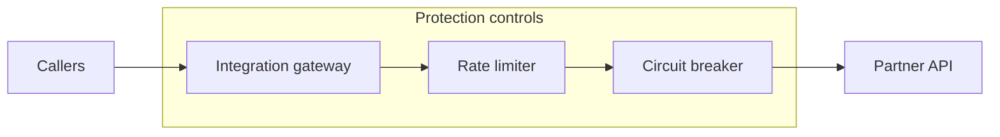

## 17. Canonical data model
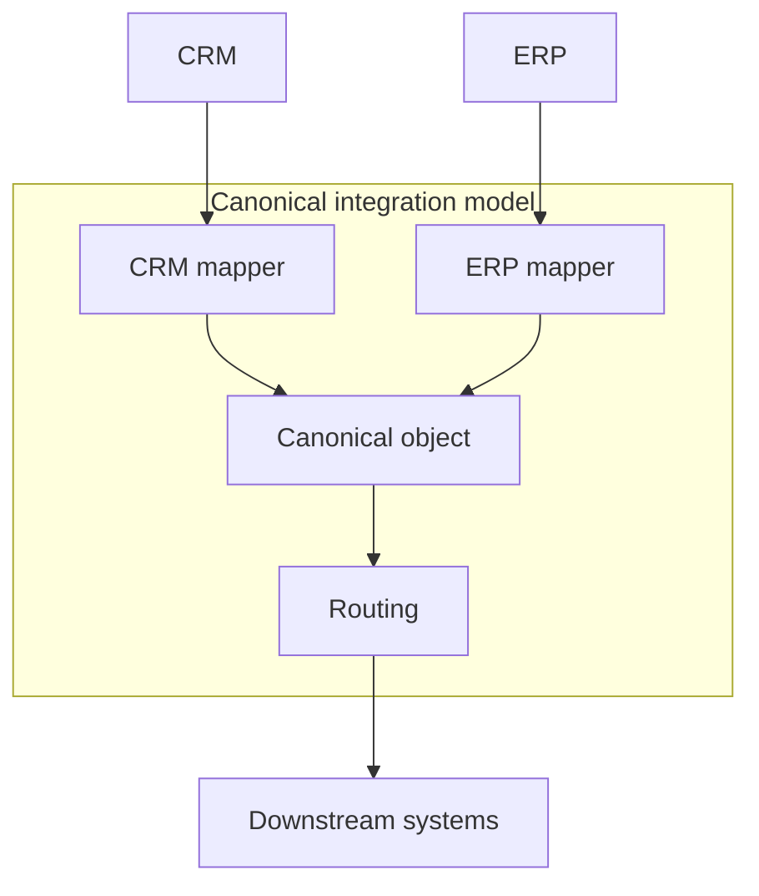

## 18. Secure partner API exchange
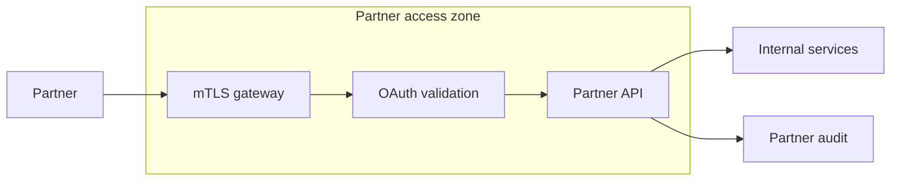

## 19. Integration observability
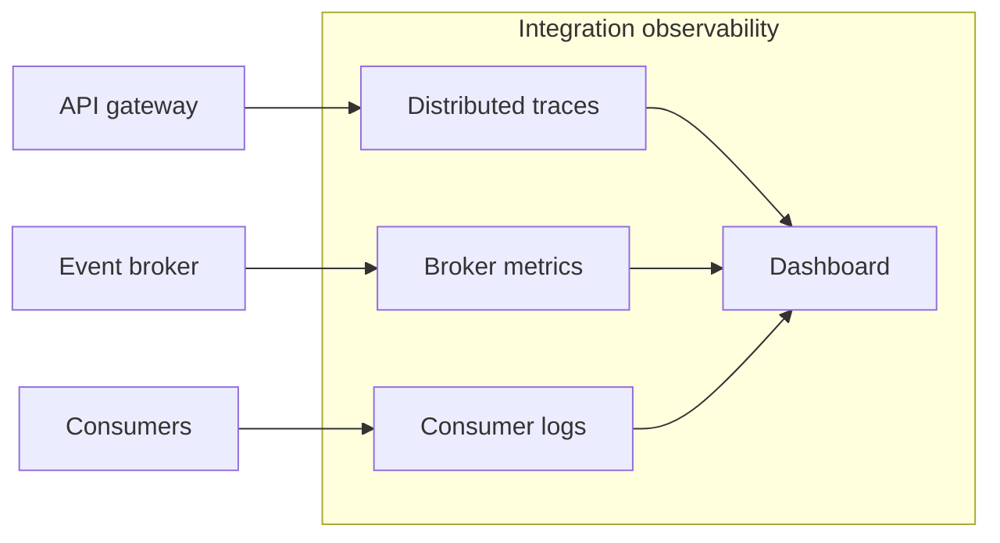

## 20. Event replay architecture
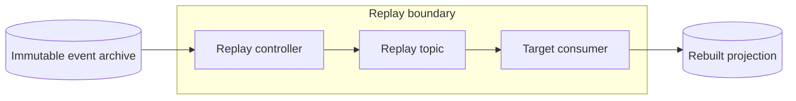