# Kubernetes and Runtime Architecture Examples

## 1. Kubernetes request path
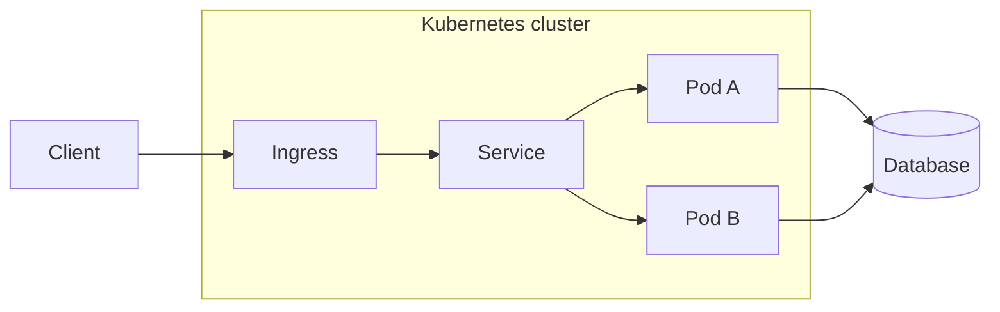

## 2. Kubernetes control loop
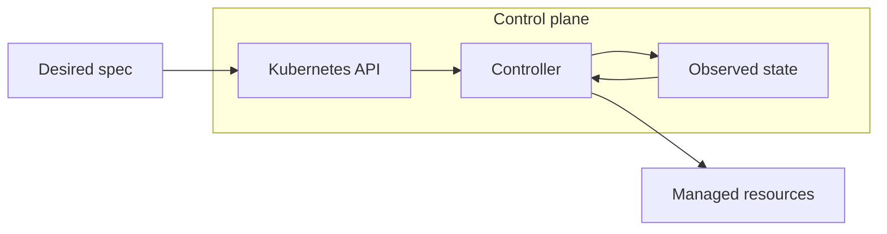

## 3. Namespace isolation
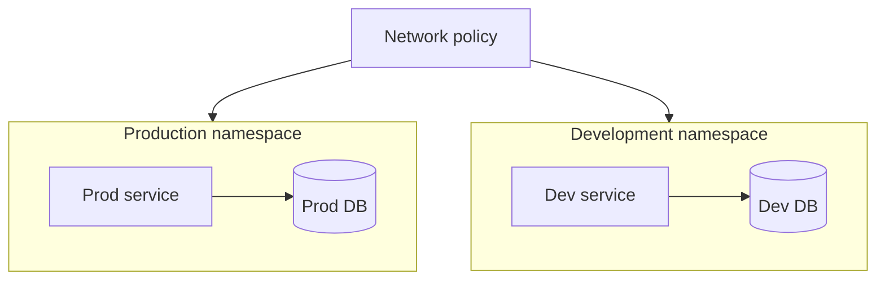

## 4. Service mesh mTLS
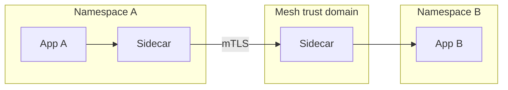

## 5. Kubernetes operator
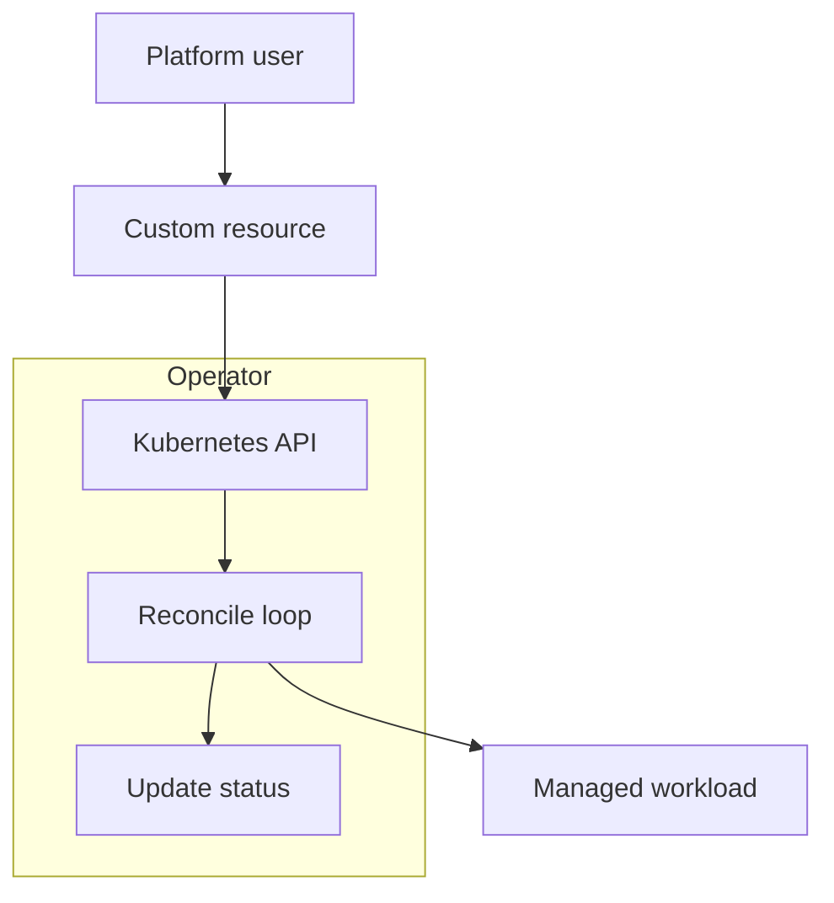

## 6. Admission control
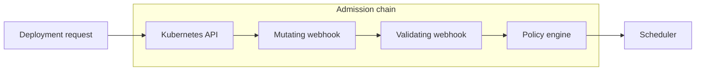

## 7. GitOps cluster management
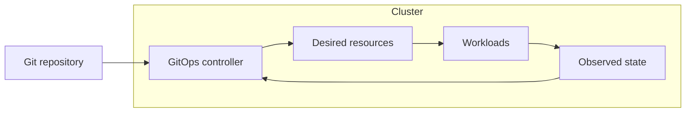

## 8. Multi-cluster fleet
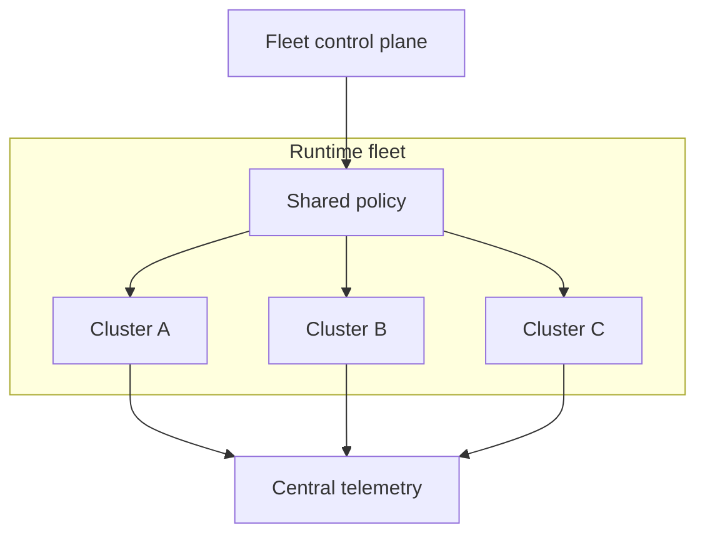

## 9. Cluster autoscaling
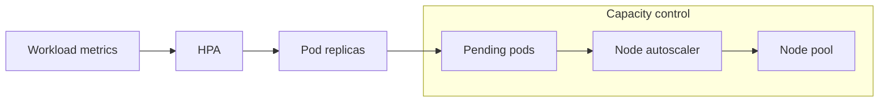

## 10. Batch job isolation
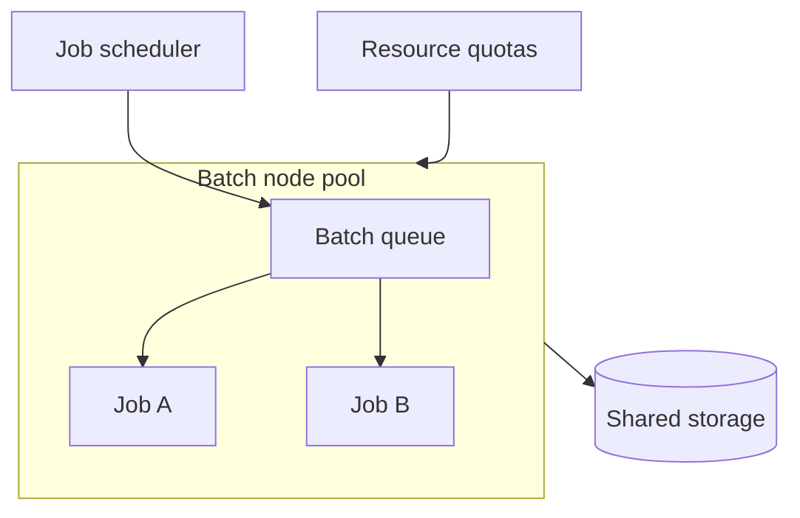

## 11. GPU workload pool
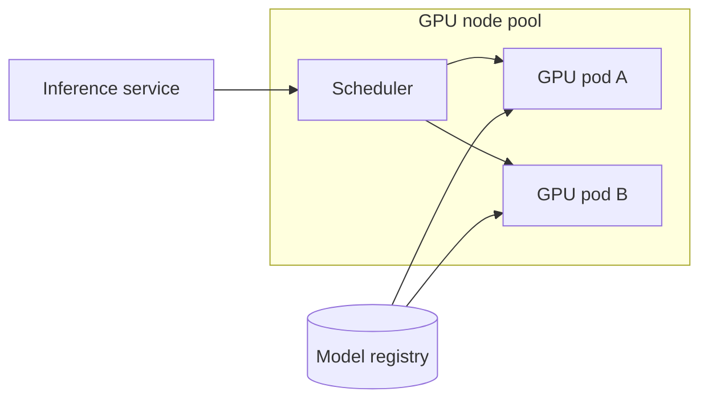

## 12. Stateful application
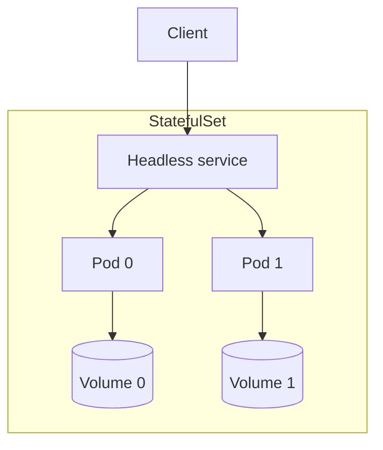

## 13. External secrets operator
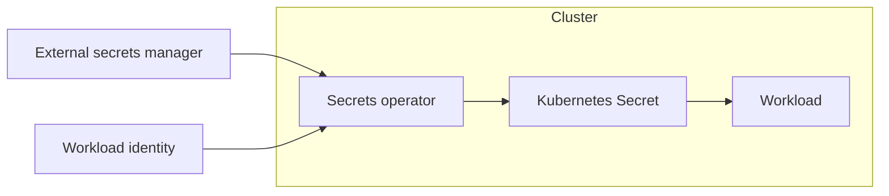

## 14. Progressive delivery controller
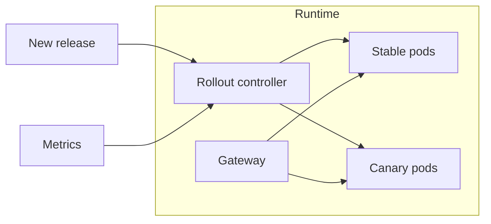

## 15. Pod security boundary
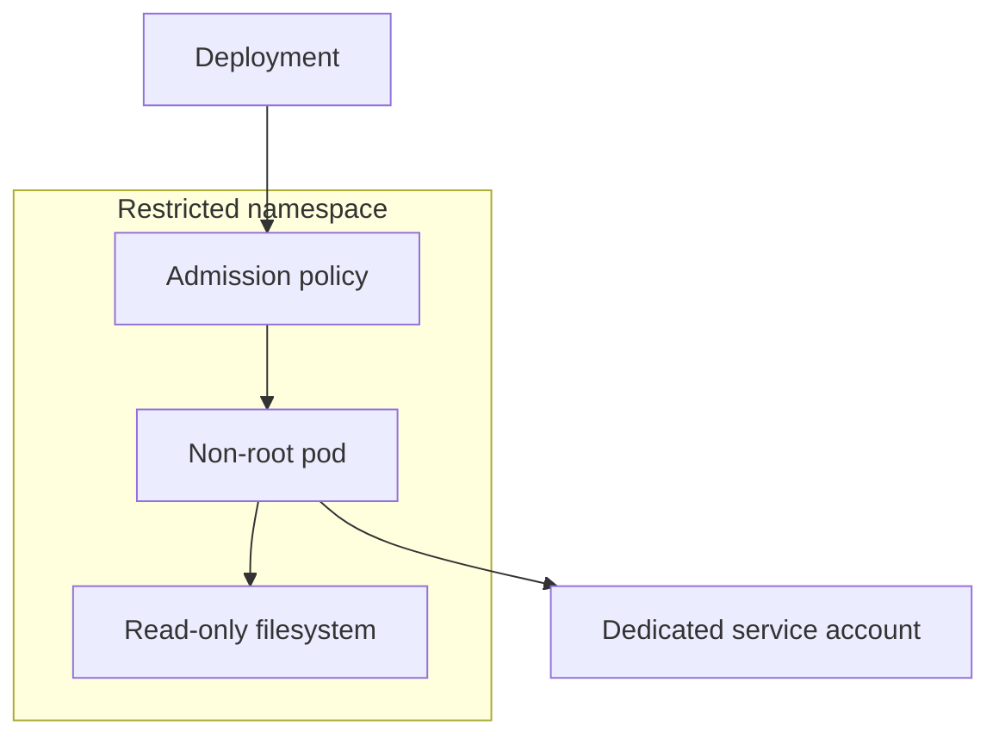

## 16. Runtime observability sidecars
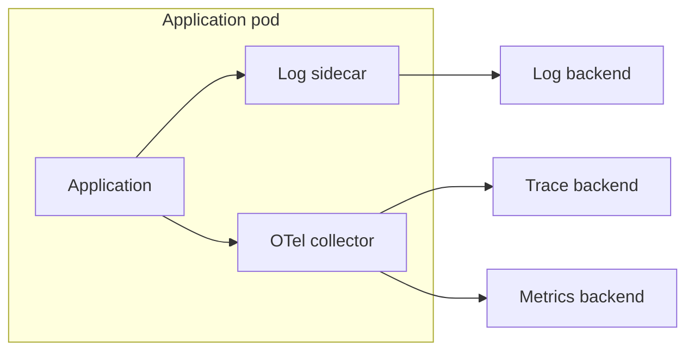

## 17. Queue-driven worker scaling
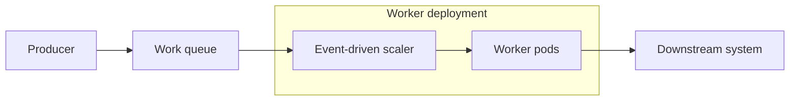

## 18. Blue-green namespace deployment
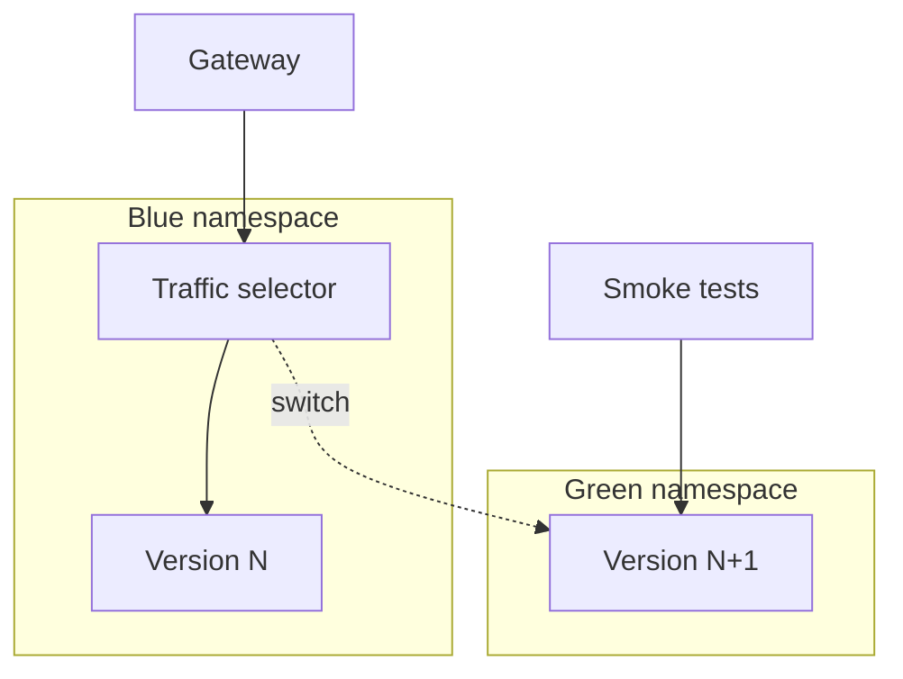

## 19. Multi-tenant cluster with dedicated namespaces
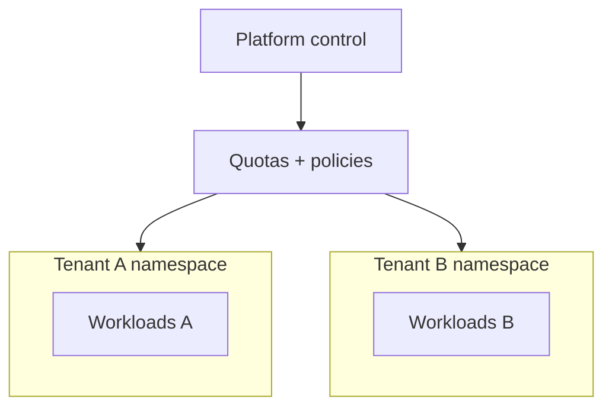

## 20. Cluster egress gateway
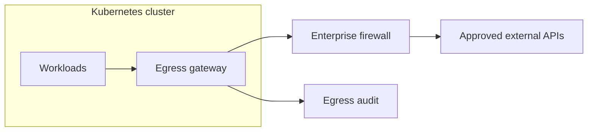