# Enterprise Reliability and Disaster Recovery Architecture Examples

## 1. Multi-zone high availability
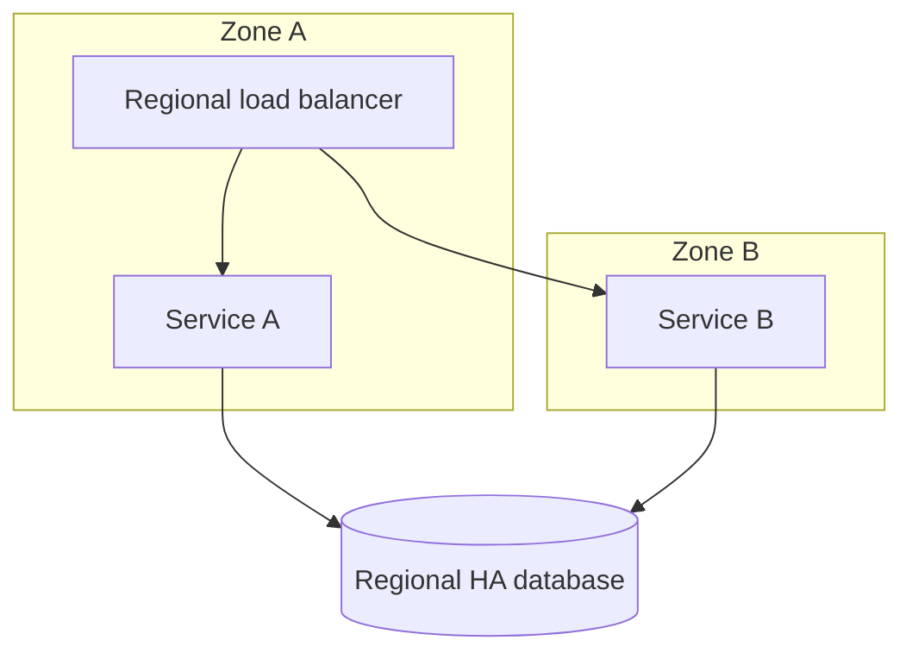

## 2. Active-passive application DR
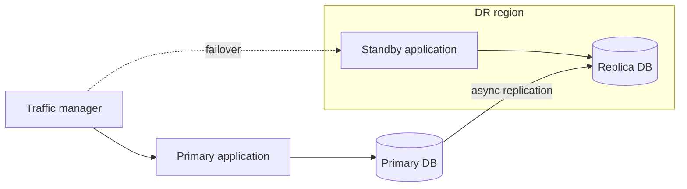

## 3. Backup isolation boundary
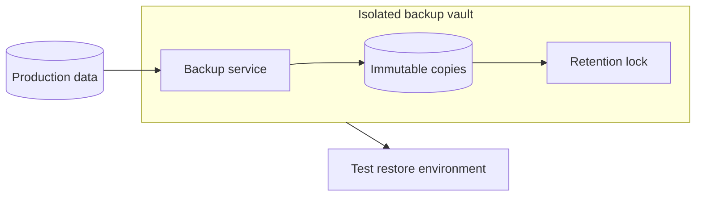

## 4. Cross-region object replication
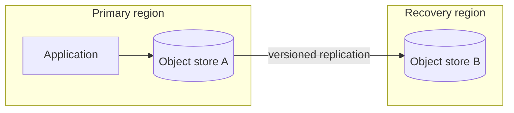

## 5. Read replica scaling
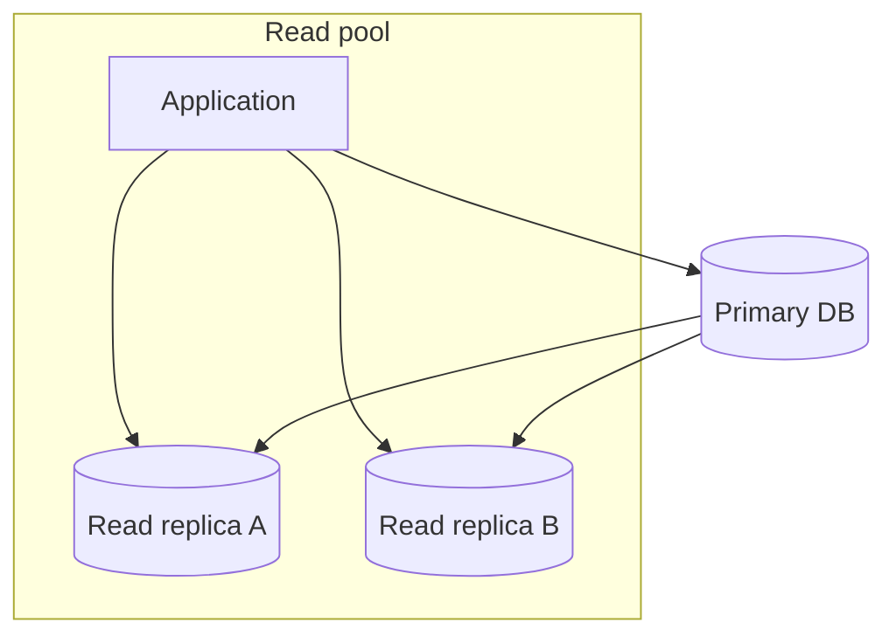

## 6. Circuit-breaker boundary
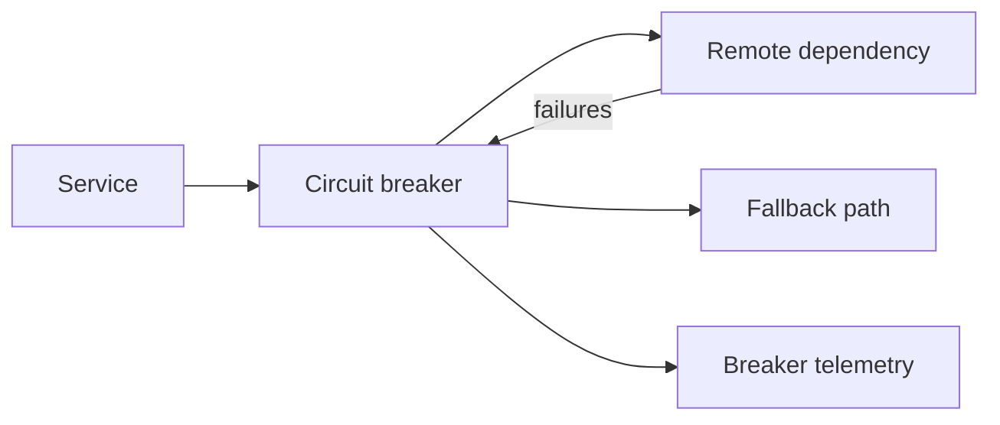

## 7. Bulkhead isolation
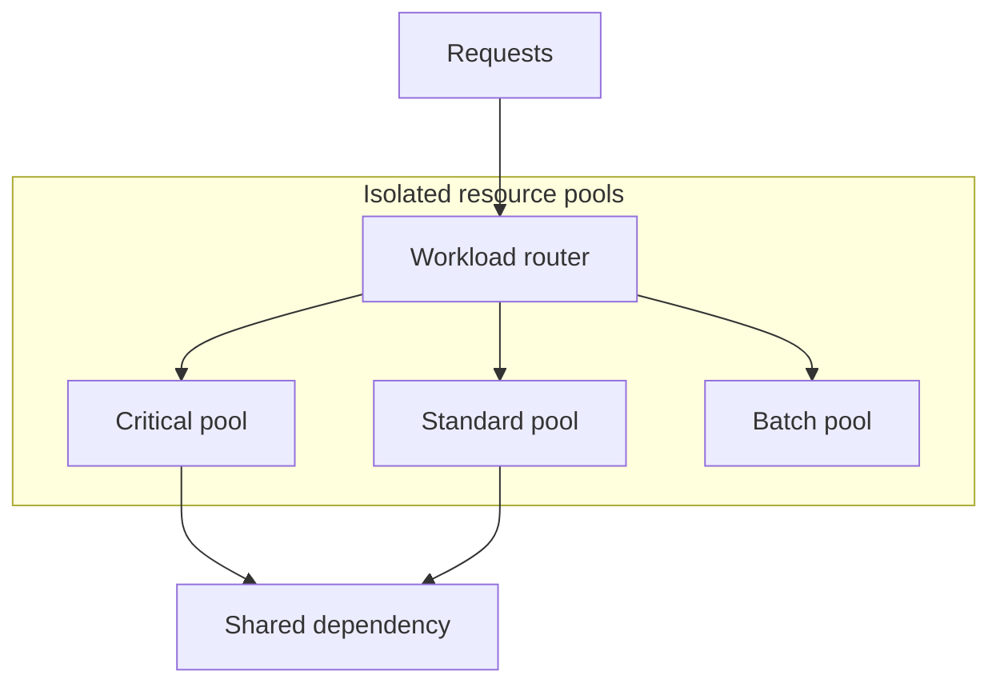

## 8. Retry with DLQ
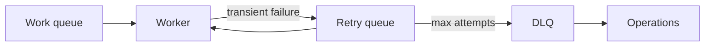

## 9. Regional failover with quorum
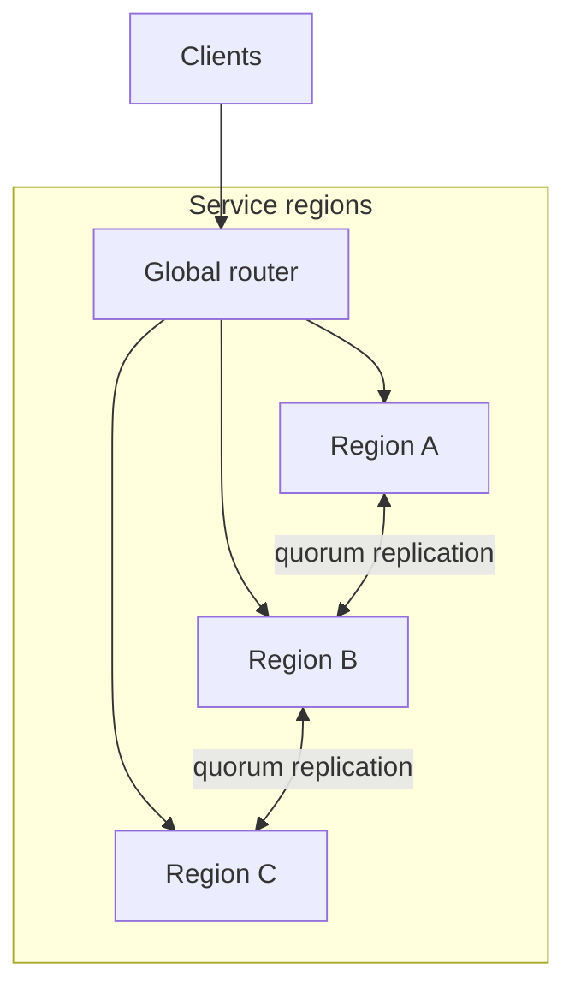

## 10. Dependency degradation mode
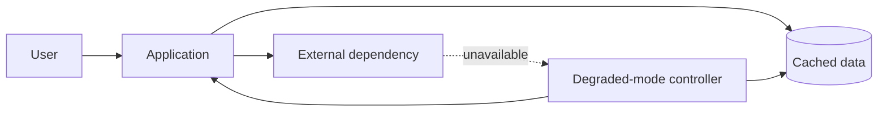

## 11. SLO telemetry path
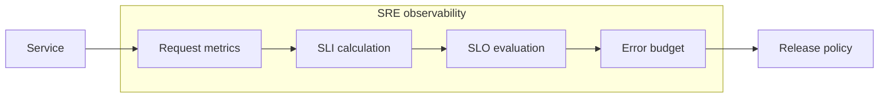

## 12. Multi-provider dependency failover
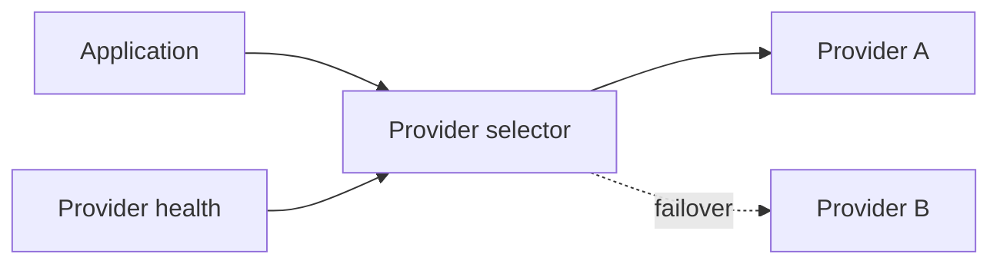

## 13. Database point-in-time recovery
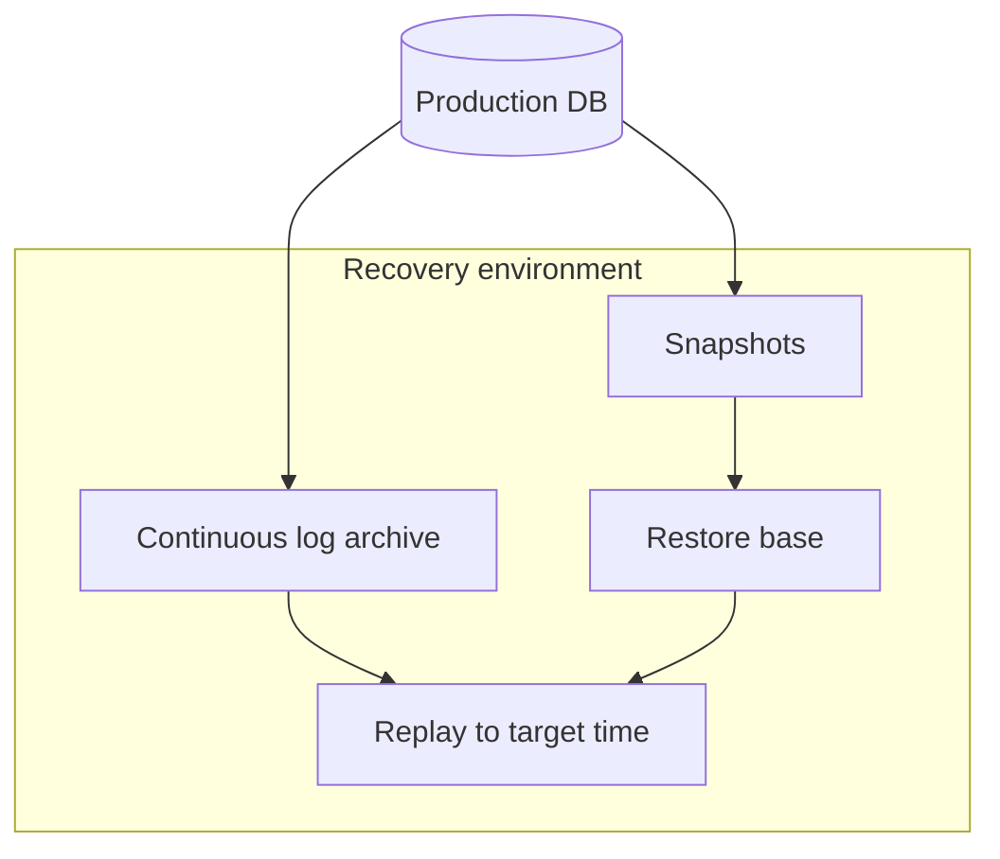

## 14. Ransomware-resilient backups
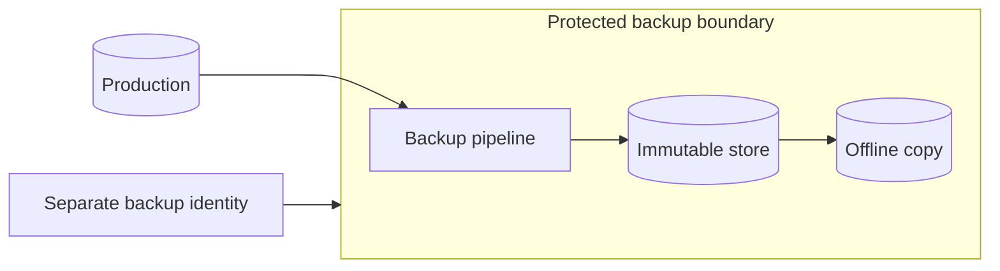

## 15. Regional service evacuation
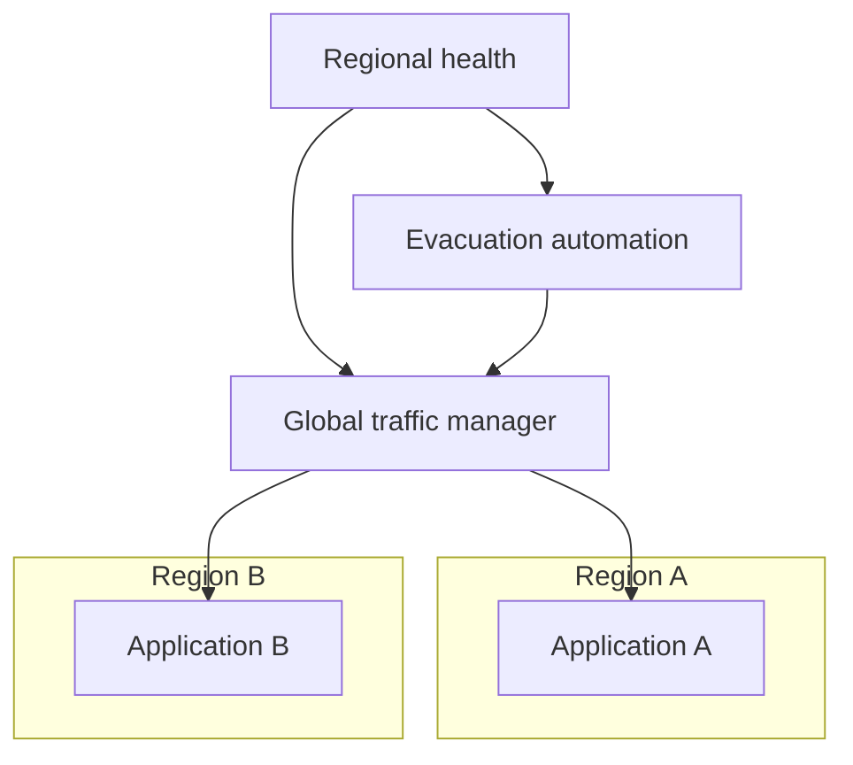

## 16. Cell-based architecture
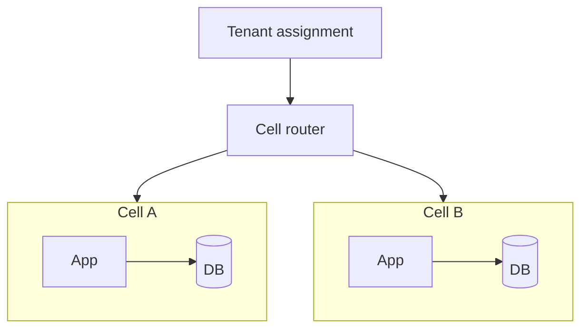

## 17. Graceful load shedding
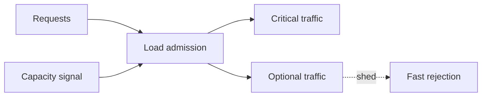

## 18. Chaos testing boundary
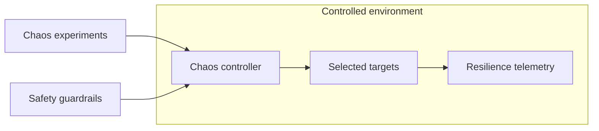

## 19. Dependency health aggregation
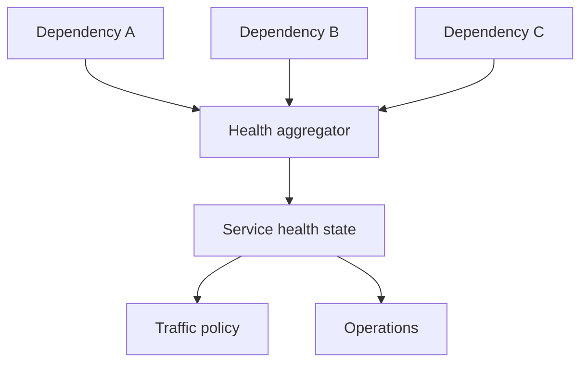

## 20. DR command center architecture
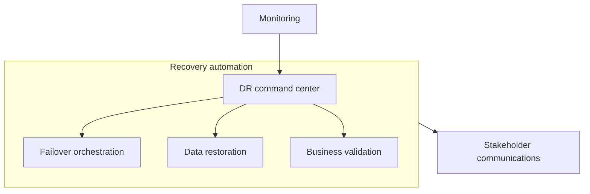